# Examen 1ª Evaluación - Ramón Manuel Porto Hombre

## 1.Explica métodos para 'abrir' una consola/shell a un contenedor que se está ejecutando

Con el comando docker exec podemos abrir una terminal al abrir el contenedor su sintaxis es la siguiente:
~~~
docker exec contenedor bash
~~~ 
contenedor sería el nombre del contenedor y bash es el intérprete.

También existe la opción de una vez iniciado el contenedor, se haga clic derecho sobre él y presionar la opción "*Attach shell*"

## 2.En el contenedor anterior con que opciones tiene que haber sido arrancado para poder interactuar con las entradas y salidas del contenedor

Es el mismo comando anterior añadiendo la opción "***-it***", que es la que permite interactuar con el contenedor.

~~~
docker exec -it contenedor bash
~~~ 
    
## 3.¿Cómo sería un fichero docker-compose para que dos contenedores se comuniquen entre si en una red solo de ellos?
Habría que crear la subred en el docker-compose.yml de la siguente forma:
~~~
networks:
    my-network:
      ipam:
        config:
          - subnet: 10.0.9.0/24
            gateway: 10.0.9.0
~~~

Posteriormente añadiríamos el apartado networks a cada contenedor de la siguiente forma:
~~~
networks:
      my-network:
        ipv4_address: 10.0.9.33
~~~

Ambos contenedores deben estar en la misma red para poder comunicarse entre si.    

## 4.¿Qué hay que añadir al fichero anterior para que un contenedor tenga la IP fija?

Se debe añadir la opción "**ipv4_address**" y a continuación la IP deseada para asignarsela de manera fija.
~~~
networks:
      my-network:
        ipv4_address: 10.0.9.33
~~~
En este caso la ip asignada sería la 10.0.9.33    
## 5.¿Que comando de consola puedo usar para saber las ips de los contenedores anteriores? Filtra todo lo que puedas la salida.

Mediante el comando docker inspect podemos obtener las IPs de los contenedores. La sintaxis es la siguiente:

~~~
docker inspect bin9_subnet
~~~

Inspeccionamos la red a la que pertenecen los contenedores, *bind9_subnet* en este caso y obtenemos la siguiente salida por consola.

Salida por consola del comando:
```
console
"4e86cf951c0444c4af33e712531bea5cdf46333259b9c6a049a79232326fb552": {
                "Name": "asir_bind9",
                "EndpointID": "09e81eba45a3b67f2d665aebb18053c1991e9f45b30dadcc65ad1426eb61662e",
                "MacAddress": "02:42:ac:1c:05:01",
                "IPv4Address": "172.28.5.1/24",
                "IPv6Address": ""
            },
            "f32cba4c774aaa37087290486cdadee492230b42c6ebe12d068803bf61c5a0aa": {
                "Name": "asir_cliente_dns",
                "EndpointID": "77d78f17cf027f9306b2a763104d8e9dfb1041b37027440cddf77a3db6fd1205",
                "MacAddress": "02:42:ac:1c:05:21",
                "IPv4Address": "172.28.5.33/24",
                "IPv6Address": ""
            }
```


## 6.¿Cual es la funcionalidad del apartado "ports" en docker compose?
Sirve para mapear los puertos del contenedor con los puertos del host.
Un ejemplo:
~~~
ports:
- "53:53"
~~~
En este caso se mapea el puerto 53 tanto del contenedor como del host.   
   

## 7.¿Para que sirve el registro CNAME? Pon un ejemplo
Indica que un dominio es un alias de otro dominio.

mi-sitio.com    IN  A   33.33.33.33
www     CNAME   mi-sitio.com

En este ejemplo al consultar www.mi-sitio.com devolvería mi-sitio.com

## 8.¿Como puedo hacer para que la configuración de un contenedor DNS no se borre si creo otro contenedor?

Mediante el uso de volúmenes. El comando es el siguiente:

~~~
docker volume create volumen
~~~
Siendo volumen el nombre que le queramos poner al volumen.
   
## 9.Añade una zona tiendadeelectronica.int en tu docker DNS que tenga

En primer lugar, una vez se hayan configurado correctamente los ficheros de configuración y el docker compose, procedemos a lanzar dicho archivo con el siguiente comando:

~~~
docker compose up -d
~~~
La opción -d es para que se ejecute en segundo plano.

Una vez tenemos los contenedores iniciados haremos un attach shell al contenedor tal y como se muestra en la siguiente imagen:

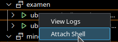

Ahora comprobaremos que funciona correctamente mediante el comando dig, en primer lugar comprobamos *www.tiendadeelectronica.int*
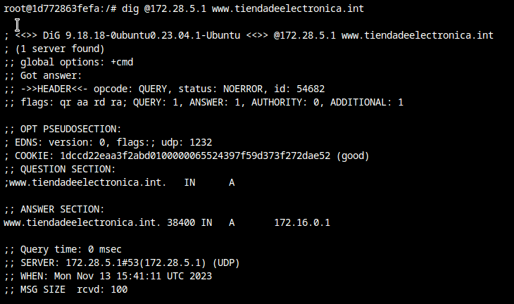

Seguimos comprobando el registro *CNAME*
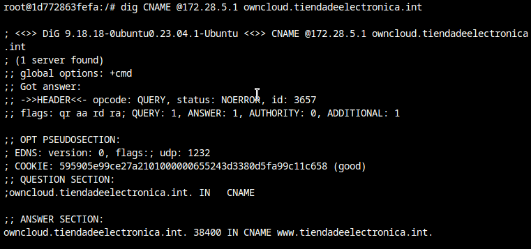

Por último comprobamos el registro *TXT*
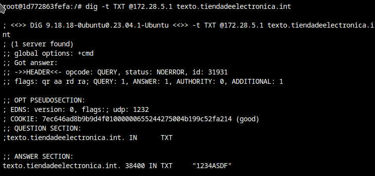

Para finalizar vemos los logs haciendo clic derecho sobre el contenedor y seleccionando la opción "*View Logs*"

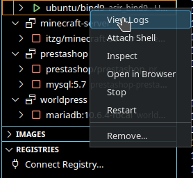
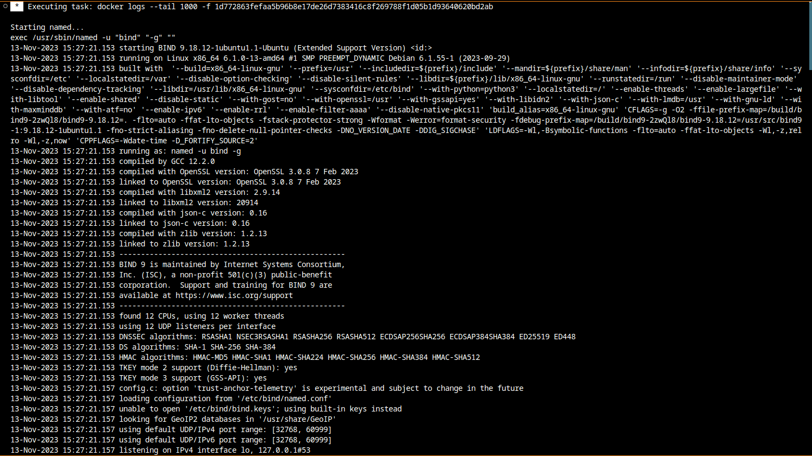


Salida por consola de los logs:
```
console
Starting named...
exec /usr/sbin/named -u "bind" "-g" ""
13-Nov-2023 15:27:21.153 starting BIND 9.18.12-1ubuntu1.1-Ubuntu (Extended Support Version) <id:>
13-Nov-2023 15:27:21.153 running on Linux x86_64 6.1.0-13-amd64 #1 SMP PREEMPT_DYNAMIC Debian 6.1.55-1 (2023-09-29)
13-Nov-2023 15:27:21.153 built with  '--build=x86_64-linux-gnu' '--prefix=/usr' '--includedir=${prefix}/include' '--mandir=${prefix}/share/man' '--infodir=${prefix}/share/info' '--sysconfdir=/etc' '--localstatedir=/var' '--disable-option-checking' '--disable-silent-rules' '--libdir=${prefix}/lib/x86_64-linux-gnu' '--runstatedir=/run' '--disable-maintainer-mode' '--disable-dependency-tracking' '--libdir=/usr/lib/x86_64-linux-gnu' '--sysconfdir=/etc/bind' '--with-python=python3' '--localstatedir=/' '--enable-threads' '--enable-largefile' '--with-libtool' '--enable-shared' '--disable-static' '--with-gost=no' '--with-openssl=/usr' '--with-gssapi=yes' '--with-libidn2' '--with-json-c' '--with-lmdb=/usr' '--with-gnu-ld' '--with-maxminddb' '--with-atf=no' '--enable-ipv6' '--enable-rrl' '--enable-filter-aaaa' '--disable-native-pkcs11' 'build_alias=x86_64-linux-gnu' 'CFLAGS=-g -O2 -ffile-prefix-map=/build/bind9-2zwQl8/bind9-9.18.12=. -flto=auto -ffat-lto-objects -fstack-protector-strong -Wformat -Werror=format-security -fdebug-prefix-map=/build/bind9-2zwQl8/bind9-9.18.12=/usr/src/bind9-1:9.18.12-1ubuntu1.1 -fno-strict-aliasing -fno-delete-null-pointer-checks -DNO_VERSION_DATE -DDIG_SIGCHASE' 'LDFLAGS=-Wl,-Bsymbolic-functions -flto=auto -ffat-lto-objects -Wl,-z,relro -Wl,-z,now' 'CPPFLAGS=-Wdate-time -D_FORTIFY_SOURCE=2'
13-Nov-2023 15:27:21.153 running as: named -u bind -g
13-Nov-2023 15:27:21.153 compiled by GCC 12.2.0
13-Nov-2023 15:27:21.153 compiled with OpenSSL version: OpenSSL 3.0.8 7 Feb 2023
13-Nov-2023 15:27:21.153 linked to OpenSSL version: OpenSSL 3.0.8 7 Feb 2023
13-Nov-2023 15:27:21.153 compiled with libxml2 version: 2.9.14
13-Nov-2023 15:27:21.153 linked to libxml2 version: 20914
13-Nov-2023 15:27:21.153 compiled with json-c version: 0.16
13-Nov-2023 15:27:21.153 linked to json-c version: 0.16
13-Nov-2023 15:27:21.153 compiled with zlib version: 1.2.13
13-Nov-2023 15:27:21.153 linked to zlib version: 1.2.13
13-Nov-2023 15:27:21.153 ----------------------------------------------------
13-Nov-2023 15:27:21.153 BIND 9 is maintained by Internet Systems Consortium,
13-Nov-2023 15:27:21.153 Inc. (ISC), a non-profit 501(c)(3) public-benefit 
13-Nov-2023 15:27:21.153 corporation.  Support and training for BIND 9 are 
13-Nov-2023 15:27:21.153 available at https://www.isc.org/support
13-Nov-2023 15:27:21.153 ----------------------------------------------------
13-Nov-2023 15:27:21.153 found 12 CPUs, using 12 worker threads
13-Nov-2023 15:27:21.153 using 12 UDP listeners per interface
13-Nov-2023 15:27:21.153 DNSSEC algorithms: RSASHA1 NSEC3RSASHA1 RSASHA256 RSASHA512 ECDSAP256SHA256 ECDSAP384SHA384 ED25519 ED448
13-Nov-2023 15:27:21.153 DS algorithms: SHA-1 SHA-256 SHA-384
13-Nov-2023 15:27:21.153 HMAC algorithms: HMAC-MD5 HMAC-SHA1 HMAC-SHA224 HMAC-SHA256 HMAC-SHA384 HMAC-SHA512
13-Nov-2023 15:27:21.153 TKEY mode 2 support (Diffie-Hellman): yes
13-Nov-2023 15:27:21.153 TKEY mode 3 support (GSS-API): yes
13-Nov-2023 15:27:21.157 config.c: option 'trust-anchor-telemetry' is experimental and subject to change in the future
13-Nov-2023 15:27:21.157 loading configuration from '/etc/bind/named.conf'
13-Nov-2023 15:27:21.157 unable to open '/etc/bind/bind.keys'; using built-in keys instead
13-Nov-2023 15:27:21.157 looking for GeoIP2 databases in '/usr/share/GeoIP'
13-Nov-2023 15:27:21.157 using default UDP/IPv4 port range: [32768, 60999]
13-Nov-2023 15:27:21.157 using default UDP/IPv6 port range: [32768, 60999]
13-Nov-2023 15:27:21.157 listening on IPv4 interface lo, 127.0.0.1#53
13-Nov-2023 15:27:21.157 listening on IPv4 interface eth0, 172.28.5.1#53
13-Nov-2023 15:27:21.157 generating session key for dynamic DNS
13-Nov-2023 15:27:21.157 sizing zone task pool based on 6 zones
13-Nov-2023 15:27:21.157 none:99: 'max-cache-size 90%' - setting to 14187MB (out of 15763MB)
13-Nov-2023 15:27:21.157 using built-in root key for view _default
13-Nov-2023 15:27:21.157 set up managed keys zone for view _default, file 'managed-keys.bind'
13-Nov-2023 15:27:21.157 configuring command channel from '/etc/bind/rndc.key'
13-Nov-2023 15:27:21.157 command channel listening on 127.0.0.1#953
13-Nov-2023 15:27:21.157 configuring command channel from '/etc/bind/rndc.key'
13-Nov-2023 15:27:21.161 command channel listening on ::1#953
13-Nov-2023 15:27:21.161 not using config file logging statement for logging due to -g option
13-Nov-2023 15:27:21.161 managed-keys-zone: loaded serial 0
13-Nov-2023 15:27:21.161 zone 0.in-addr.arpa/IN: loading from master file /etc/bind/db.0 failed: file not found
13-Nov-2023 15:27:21.161 zone 0.in-addr.arpa/IN: not loaded due to errors.
13-Nov-2023 15:27:21.161 zone 127.in-addr.arpa/IN: loading from master file /etc/bind/db.127 failed: file not found
13-Nov-2023 15:27:21.161 zone 127.in-addr.arpa/IN: not loaded due to errors.
13-Nov-2023 15:27:21.161 zone 255.in-addr.arpa/IN: loading from master file /etc/bind/db.255 failed: file not found
13-Nov-2023 15:27:21.161 zone 255.in-addr.arpa/IN: not loaded due to errors.
13-Nov-2023 15:27:21.161 zone localhost/IN: loading from master file /etc/bind/db.local failed: file not found
13-Nov-2023 15:27:21.161 zone localhost/IN: not loaded due to errors.
13-Nov-2023 15:27:21.161 /var/lib/bind/db.tiendadeelectronica.int:13: file does not end with newline
13-Nov-2023 15:27:21.161 zone tiendadeelectronica.int/IN: NS 'db.tiendadeelectronica.int' has no address records (A or AAAA)
13-Nov-2023 15:27:21.161 zone tiendadeelectronica.int/IN: not loaded due to errors.
13-Nov-2023 15:27:21.161 all zones loaded
13-Nov-2023 15:27:21.161 running
13-Nov-2023 15:27:21.165 managed-keys-zone: No DNSKEY RRSIGs found for '.': success
13-Nov-2023 15:28:20.556 no valid RRSIG resolving 'com/DS/IN': 1.1.1.1#53
13-Nov-2023 15:28:20.564 no valid RRSIG resolving 'com/DS/IN': 8.8.8.8#53
13-Nov-2023 15:28:20.564 broken trust chain resolving 'security.ubuntu.com/A/IN': 8.8.8.8#53
13-Nov-2023 15:28:20.564 broken trust chain resolving 'archive.ubuntu.com/A/IN': 8.8.8.8#53
13-Nov-2023 15:28:21.576 validating security.ubuntu.com/A: bad cache hit (com/DS)
13-Nov-2023 15:28:21.576 broken trust chain resolving 'security.ubuntu.com/A/IN': 1.1.1.1#53
13-Nov-2023 15:28:21.580 validating archive.ubuntu.com/A: bad cache hit (com/DS)
13-Nov-2023 15:28:21.580 broken trust chain resolving 'archive.ubuntu.com/A/IN': 1.1.1.1#53
13-Nov-2023 15:28:23.588 validating security.ubuntu.com/A: bad cache hit (com/DS)
13-Nov-2023 15:28:23.588 broken trust chain resolving 'security.ubuntu.com/A/IN': 8.8.8.8#53
13-Nov-2023 15:28:23.592 validating archive.ubuntu.com/A: bad cache hit (com/DS)
13-Nov-2023 15:28:23.592 broken trust chain resolving 'archive.ubuntu.com/A/IN': 8.8.8.8#53
13-Nov-2023 15:32:14.947 validating ./NS: got insecure response; parent indicates it should be secure
13-Nov-2023 15:32:14.947 insecurity proof failed resolving './NS/IN': 8.8.8.8#53
13-Nov-2023 15:32:14.959 validating ./NS: got insecure response; parent indicates it should be secure
13-Nov-2023 15:32:14.959 insecurity proof failed resolving './NS/IN': 1.1.1.1#53
13-Nov-2023 15:34:39.949 no longer listening on 127.0.0.1#53
13-Nov-2023 15:34:39.949 no longer listening on 172.28.5.1#53
13-Nov-2023 15:34:39.953 shutting down
13-Nov-2023 15:34:39.953 stopping command channel on 127.0.0.1#953
13-Nov-2023 15:34:39.953 stopping command channel on ::1#953
13-Nov-2023 15:34:39.953 automatic interface scanning terminated: end of file
13-Nov-2023 15:34:39.961 exiting
Starting named...
exec /usr/sbin/named -u "bind" "-g" ""
13-Nov-2023 15:34:40.761 starting BIND 9.18.18-0ubuntu0.23.04.1-Ubuntu (Extended Support Version) <id:>
13-Nov-2023 15:34:40.761 running on Linux x86_64 6.1.0-13-amd64 #1 SMP PREEMPT_DYNAMIC Debian 6.1.55-1 (2023-09-29)
13-Nov-2023 15:34:40.761 built with  '--build=x86_64-linux-gnu' '--prefix=/usr' '--includedir=${prefix}/include' '--mandir=${prefix}/share/man' '--infodir=${prefix}/share/info' '--sysconfdir=/etc' '--localstatedir=/var' '--disable-option-checking' '--disable-silent-rules' '--libdir=${prefix}/lib/x86_64-linux-gnu' '--runstatedir=/run' '--disable-maintainer-mode' '--disable-dependency-tracking' '--libdir=/usr/lib/x86_64-linux-gnu' '--sysconfdir=/etc/bind' '--with-python=python3' '--localstatedir=/' '--enable-threads' '--enable-largefile' '--with-libtool' '--enable-shared' '--disable-static' '--with-gost=no' '--with-openssl=/usr' '--with-gssapi=yes' '--with-libidn2' '--with-json-c' '--with-lmdb=/usr' '--with-gnu-ld' '--with-maxminddb' '--with-atf=no' '--enable-ipv6' '--enable-rrl' '--enable-filter-aaaa' '--disable-native-pkcs11' 'build_alias=x86_64-linux-gnu' 'CFLAGS=-g -O2 -ffile-prefix-map=/build/bind9-VMBSpu/bind9-9.18.18=. -flto=auto -ffat-lto-objects -fstack-protector-strong -Wformat -Werror=format-security -fdebug-prefix-map=/build/bind9-VMBSpu/bind9-9.18.18=/usr/src/bind9-1:9.18.18-0ubuntu0.23.04.1 -fno-strict-aliasing -fno-delete-null-pointer-checks -DNO_VERSION_DATE -DDIG_SIGCHASE' 'LDFLAGS=-Wl,-Bsymbolic-functions -flto=auto -ffat-lto-objects -Wl,-z,relro -Wl,-z,now' 'CPPFLAGS=-Wdate-time -D_FORTIFY_SOURCE=2'
13-Nov-2023 15:34:40.761 running as: named -u bind -g
13-Nov-2023 15:34:40.761 compiled by GCC 12.3.0
13-Nov-2023 15:34:40.761 compiled with OpenSSL version: OpenSSL 3.0.8 7 Feb 2023
13-Nov-2023 15:34:40.761 linked to OpenSSL version: OpenSSL 3.0.8 7 Feb 2023
13-Nov-2023 15:34:40.761 compiled with libuv version: 1.44.2
13-Nov-2023 15:34:40.761 linked to libuv version: 1.44.2
13-Nov-2023 15:34:40.761 compiled with libxml2 version: 2.9.14
13-Nov-2023 15:34:40.761 linked to libxml2 version: 20914
13-Nov-2023 15:34:40.761 compiled with json-c version: 0.16
13-Nov-2023 15:34:40.761 linked to json-c version: 0.16
13-Nov-2023 15:34:40.761 compiled with zlib version: 1.2.13
13-Nov-2023 15:34:40.761 linked to zlib version: 1.2.13
13-Nov-2023 15:34:40.761 ----------------------------------------------------
13-Nov-2023 15:34:40.761 BIND 9 is maintained by Internet Systems Consortium,
13-Nov-2023 15:34:40.761 Inc. (ISC), a non-profit 501(c)(3) public-benefit 
13-Nov-2023 15:34:40.761 corporation.  Support and training for BIND 9 are 
13-Nov-2023 15:34:40.761 available at https://www.isc.org/support
13-Nov-2023 15:34:40.761 ----------------------------------------------------
13-Nov-2023 15:34:40.761 found 12 CPUs, using 12 worker threads
13-Nov-2023 15:34:40.761 using 12 UDP listeners per interface
13-Nov-2023 15:34:40.765 DNSSEC algorithms: RSASHA1 NSEC3RSASHA1 RSASHA256 RSASHA512 ECDSAP256SHA256 ECDSAP384SHA384 ED25519 ED448
13-Nov-2023 15:34:40.765 DS algorithms: SHA-1 SHA-256 SHA-384
13-Nov-2023 15:34:40.765 HMAC algorithms: HMAC-MD5 HMAC-SHA1 HMAC-SHA224 HMAC-SHA256 HMAC-SHA384 HMAC-SHA512
13-Nov-2023 15:34:40.765 TKEY mode 2 support (Diffie-Hellman): yes
13-Nov-2023 15:34:40.765 TKEY mode 3 support (GSS-API): yes
13-Nov-2023 15:34:40.765 config.c: option 'trust-anchor-telemetry' is experimental and subject to change in the future
13-Nov-2023 15:34:40.765 loading configuration from '/etc/bind/named.conf'
13-Nov-2023 15:34:40.765 unable to open '/etc/bind/bind.keys'; using built-in keys instead
13-Nov-2023 15:34:40.765 looking for GeoIP2 databases in '/usr/share/GeoIP'
13-Nov-2023 15:34:40.765 using default UDP/IPv4 port range: [32768, 60999]
13-Nov-2023 15:34:40.765 using default UDP/IPv6 port range: [32768, 60999]
13-Nov-2023 15:34:40.765 listening on IPv4 interface lo, 127.0.0.1#53
13-Nov-2023 15:34:40.765 listening on IPv4 interface eth0, 172.28.5.1#53
13-Nov-2023 15:34:40.765 generating session key for dynamic DNS
13-Nov-2023 15:34:40.765 sizing zone task pool based on 6 zones
13-Nov-2023 15:34:40.765 none:99: 'max-cache-size 90%' - setting to 14187MB (out of 15763MB)
13-Nov-2023 15:34:40.765 using built-in root key for view _default
13-Nov-2023 15:34:40.765 set up managed keys zone for view _default, file 'managed-keys.bind'
13-Nov-2023 15:34:40.765 configuring command channel from '/etc/bind/rndc.key'
13-Nov-2023 15:34:40.765 command channel listening on 127.0.0.1#953
13-Nov-2023 15:34:40.765 configuring command channel from '/etc/bind/rndc.key'
13-Nov-2023 15:34:40.765 command channel listening on ::1#953
13-Nov-2023 15:34:40.765 not using config file logging statement for logging due to -g option
13-Nov-2023 15:34:40.765 managed-keys-zone: loaded serial 2
13-Nov-2023 15:34:40.765 zone 127.in-addr.arpa/IN: loading from master file /etc/bind/db.127 failed: file not found
13-Nov-2023 15:34:40.765 zone 127.in-addr.arpa/IN: not loaded due to errors.
13-Nov-2023 15:34:40.765 zone 0.in-addr.arpa/IN: loading from master file /etc/bind/db.0 failed: file not found
13-Nov-2023 15:34:40.765 zone 0.in-addr.arpa/IN: not loaded due to errors.
13-Nov-2023 15:34:40.765 zone 255.in-addr.arpa/IN: loading from master file /etc/bind/db.255 failed: file not found
13-Nov-2023 15:34:40.765 zone localhost/IN: loading from master file /etc/bind/db.local failed: file not found
13-Nov-2023 15:34:40.765 zone localhost/IN: not loaded due to errors.
13-Nov-2023 15:34:40.765 zone 255.in-addr.arpa/IN: not loaded due to errors.
13-Nov-2023 15:34:40.765 /var/lib/bind/db.tiendadeelectronica.int:13: file does not end with newline
13-Nov-2023 15:34:40.765 zone tiendadeelectronica.int/IN: NS 'db.tiendadeelectronica.int' has no address records (A or AAAA)
13-Nov-2023 15:34:40.765 zone tiendadeelectronica.int/IN: not loaded due to errors.
13-Nov-2023 15:34:40.765 all zones loaded
13-Nov-2023 15:34:40.765 running
13-Nov-2023 15:34:40.773 managed-keys-zone: No DNSKEY RRSIGs found for '.': success
13-Nov-2023 15:36:23.950 no longer listening on 127.0.0.1#53
13-Nov-2023 15:36:23.950 no longer listening on 172.28.5.1#53
13-Nov-2023 15:36:23.950 shutting down
13-Nov-2023 15:36:23.950 stopping command channel on 127.0.0.1#953
13-Nov-2023 15:36:23.950 stopping command channel on ::1#953
13-Nov-2023 15:36:23.954 automatic interface scanning terminated: end of file
13-Nov-2023 15:36:23.958 exiting
Starting named...
exec /usr/sbin/named -u "bind" "-g" ""
13-Nov-2023 15:36:24.874 starting BIND 9.18.18-0ubuntu0.23.04.1-Ubuntu (Extended Support Version) <id:>
13-Nov-2023 15:36:24.874 running on Linux x86_64 6.1.0-13-amd64 #1 SMP PREEMPT_DYNAMIC Debian 6.1.55-1 (2023-09-29)
13-Nov-2023 15:36:24.874 built with  '--build=x86_64-linux-gnu' '--prefix=/usr' '--includedir=${prefix}/include' '--mandir=${prefix}/share/man' '--infodir=${prefix}/share/info' '--sysconfdir=/etc' '--localstatedir=/var' '--disable-option-checking' '--disable-silent-rules' '--libdir=${prefix}/lib/x86_64-linux-gnu' '--runstatedir=/run' '--disable-maintainer-mode' '--disable-dependency-tracking' '--libdir=/usr/lib/x86_64-linux-gnu' '--sysconfdir=/etc/bind' '--with-python=python3' '--localstatedir=/' '--enable-threads' '--enable-largefile' '--with-libtool' '--enable-shared' '--disable-static' '--with-gost=no' '--with-openssl=/usr' '--with-gssapi=yes' '--with-libidn2' '--with-json-c' '--with-lmdb=/usr' '--with-gnu-ld' '--with-maxminddb' '--with-atf=no' '--enable-ipv6' '--enable-rrl' '--enable-filter-aaaa' '--disable-native-pkcs11' 'build_alias=x86_64-linux-gnu' 'CFLAGS=-g -O2 -ffile-prefix-map=/build/bind9-VMBSpu/bind9-9.18.18=. -flto=auto -ffat-lto-objects -fstack-protector-strong -Wformat -Werror=format-security -fdebug-prefix-map=/build/bind9-VMBSpu/bind9-9.18.18=/usr/src/bind9-1:9.18.18-0ubuntu0.23.04.1 -fno-strict-aliasing -fno-delete-null-pointer-checks -DNO_VERSION_DATE -DDIG_SIGCHASE' 'LDFLAGS=-Wl,-Bsymbolic-functions -flto=auto -ffat-lto-objects -Wl,-z,relro -Wl,-z,now' 'CPPFLAGS=-Wdate-time -D_FORTIFY_SOURCE=2'
13-Nov-2023 15:36:24.874 running as: named -u bind -g
13-Nov-2023 15:36:24.874 compiled by GCC 12.3.0
13-Nov-2023 15:36:24.874 compiled with OpenSSL version: OpenSSL 3.0.8 7 Feb 2023
13-Nov-2023 15:36:24.874 linked to OpenSSL version: OpenSSL 3.0.8 7 Feb 2023
13-Nov-2023 15:36:24.874 compiled with libuv version: 1.44.2
13-Nov-2023 15:36:24.874 linked to libuv version: 1.44.2
13-Nov-2023 15:36:24.874 compiled with libxml2 version: 2.9.14
13-Nov-2023 15:36:24.874 linked to libxml2 version: 20914
13-Nov-2023 15:36:24.874 compiled with json-c version: 0.16
13-Nov-2023 15:36:24.874 linked to json-c version: 0.16
13-Nov-2023 15:36:24.874 compiled with zlib version: 1.2.13
13-Nov-2023 15:36:24.874 linked to zlib version: 1.2.13
13-Nov-2023 15:36:24.874 ----------------------------------------------------
13-Nov-2023 15:36:24.874 BIND 9 is maintained by Internet Systems Consortium,
13-Nov-2023 15:36:24.874 Inc. (ISC), a non-profit 501(c)(3) public-benefit 
13-Nov-2023 15:36:24.874 corporation.  Support and training for BIND 9 are 
13-Nov-2023 15:36:24.874 available at https://www.isc.org/support
13-Nov-2023 15:36:24.874 ----------------------------------------------------
13-Nov-2023 15:36:24.874 found 12 CPUs, using 12 worker threads
13-Nov-2023 15:36:24.874 using 12 UDP listeners per interface
13-Nov-2023 15:36:24.878 DNSSEC algorithms: RSASHA1 NSEC3RSASHA1 RSASHA256 RSASHA512 ECDSAP256SHA256 ECDSAP384SHA384 ED25519 ED448
13-Nov-2023 15:36:24.878 DS algorithms: SHA-1 SHA-256 SHA-384
13-Nov-2023 15:36:24.878 HMAC algorithms: HMAC-MD5 HMAC-SHA1 HMAC-SHA224 HMAC-SHA256 HMAC-SHA384 HMAC-SHA512
13-Nov-2023 15:36:24.878 TKEY mode 2 support (Diffie-Hellman): yes
13-Nov-2023 15:36:24.878 TKEY mode 3 support (GSS-API): yes
13-Nov-2023 15:36:24.878 config.c: option 'trust-anchor-telemetry' is experimental and subject to change in the future
13-Nov-2023 15:36:24.878 loading configuration from '/etc/bind/named.conf'
13-Nov-2023 15:36:24.878 unable to open '/etc/bind/bind.keys'; using built-in keys instead
13-Nov-2023 15:36:24.878 looking for GeoIP2 databases in '/usr/share/GeoIP'
13-Nov-2023 15:36:24.878 using default UDP/IPv4 port range: [32768, 60999]
13-Nov-2023 15:36:24.878 using default UDP/IPv6 port range: [32768, 60999]
13-Nov-2023 15:36:24.878 listening on IPv4 interface lo, 127.0.0.1#53
13-Nov-2023 15:36:24.878 listening on IPv4 interface eth0, 172.28.5.1#53
13-Nov-2023 15:36:24.878 generating session key for dynamic DNS
13-Nov-2023 15:36:24.878 sizing zone task pool based on 6 zones
13-Nov-2023 15:36:24.878 none:99: 'max-cache-size 90%' - setting to 14187MB (out of 15763MB)
13-Nov-2023 15:36:24.878 using built-in root key for view _default
13-Nov-2023 15:36:24.878 set up managed keys zone for view _default, file 'managed-keys.bind'
13-Nov-2023 15:36:24.882 configuring command channel from '/etc/bind/rndc.key'
13-Nov-2023 15:36:24.882 command channel listening on 127.0.0.1#953
13-Nov-2023 15:36:24.882 configuring command channel from '/etc/bind/rndc.key'
13-Nov-2023 15:36:24.882 command channel listening on ::1#953
13-Nov-2023 15:36:24.882 not using config file logging statement for logging due to -g option
13-Nov-2023 15:36:24.882 managed-keys-zone: loaded serial 3
13-Nov-2023 15:36:24.882 zone 127.in-addr.arpa/IN: loading from master file /etc/bind/db.127 failed: file not found
13-Nov-2023 15:36:24.882 zone 127.in-addr.arpa/IN: not loaded due to errors.
13-Nov-2023 15:36:24.882 zone 0.in-addr.arpa/IN: loading from master file /etc/bind/db.0 failed: file not found
13-Nov-2023 15:36:24.882 zone 0.in-addr.arpa/IN: not loaded due to errors.
13-Nov-2023 15:36:24.882 zone 255.in-addr.arpa/IN: loading from master file /etc/bind/db.255 failed: file not found
13-Nov-2023 15:36:24.882 zone 255.in-addr.arpa/IN: not loaded due to errors.
13-Nov-2023 15:36:24.882 zone localhost/IN: loading from master file /etc/bind/db.local failed: file not found
13-Nov-2023 15:36:24.882 zone localhost/IN: not loaded due to errors.
13-Nov-2023 15:36:24.882 /var/lib/bind/db.tiendadeelectronica.int:13: file does not end with newline
13-Nov-2023 15:36:24.882 zone tiendadeelectronica.int/IN: loaded serial 10000002
13-Nov-2023 15:36:24.882 all zones loaded
13-Nov-2023 15:36:24.882 running
13-Nov-2023 15:36:24.886 managed-keys-zone: No DNSKEY RRSIGs found for '.': success
13-Nov-2023 15:37:27.281 no valid RRSIG resolving 'com/DS/IN': 8.8.8.8#53
13-Nov-2023 15:37:27.289 no valid RRSIG resolving 'com/DS/IN': 1.1.1.1#53
13-Nov-2023 15:37:27.289 broken trust chain resolving 'archive.ubuntu.com/A/IN': 1.1.1.1#53
13-Nov-2023 15:37:27.289 broken trust chain resolving 'security.ubuntu.com/A/IN': 1.1.1.1#53
13-Nov-2023 15:37:28.309 validating security.ubuntu.com/A: bad cache hit (com/DS)
13-Nov-2023 15:37:28.309 broken trust chain resolving 'security.ubuntu.com/A/IN': 1.1.1.1#53
13-Nov-2023 15:37:28.313 validating archive.ubuntu.com/A: bad cache hit (com/DS)
13-Nov-2023 15:37:28.313 broken trust chain resolving 'archive.ubuntu.com/A/IN': 1.1.1.1#53
13-Nov-2023 15:37:30.321 validating security.ubuntu.com/A: bad cache hit (com/DS)
13-Nov-2023 15:37:30.321 broken trust chain resolving 'security.ubuntu.com/A/IN': 8.8.8.8#53
13-Nov-2023 15:37:30.325 validating archive.ubuntu.com/A: bad cache hit (com/DS)
13-Nov-2023 15:37:30.325 broken trust chain resolving 'archive.ubuntu.com/A/IN': 8.8.8.8#53
13-Nov-2023 15:37:34.329 validating security.ubuntu.com/A: bad cache hit (com/DS)
13-Nov-2023 15:37:34.329 broken trust chain resolving 'security.ubuntu.com/A/IN': 8.8.8.8#53
13-Nov-2023 15:37:34.333 validating archive.ubuntu.com/A: bad cache hit (com/DS)
13-Nov-2023 15:37:34.333 broken trust chain resolving 'archive.ubuntu.com/A/IN': 8.8.8.8#53
13-Nov-2023 15:37:48.298 validating security.ubuntu.com/A: bad cache hit (com/DS)
13-Nov-2023 15:37:48.298 broken trust chain resolving 'security.ubuntu.com/A/IN': 8.8.8.8#53
13-Nov-2023 15:37:48.302 validating archive.ubuntu.com/A: bad cache hit (com/DS)
13-Nov-2023 15:37:48.302 broken trust chain resolving 'archive.ubuntu.com/A/IN': 8.8.8.8#53
13-Nov-2023 15:37:49.310 validating security.ubuntu.com/A: bad cache hit (com/DS)
13-Nov-2023 15:37:49.310 broken trust chain resolving 'security.ubuntu.com/A/IN': 8.8.8.8#53
13-Nov-2023 15:37:49.314 validating archive.ubuntu.com/A: bad cache hit (com/DS)
13-Nov-2023 15:37:49.314 broken trust chain resolving 'archive.ubuntu.com/A/IN': 8.8.8.8#53
13-Nov-2023 15:37:51.346 validating security.ubuntu.com/A: bad cache hit (com/DS)
13-Nov-2023 15:37:51.346 broken trust chain resolving 'security.ubuntu.com/A/IN': 8.8.8.8#53
13-Nov-2023 15:37:51.350 validating archive.ubuntu.com/A: bad cache hit (com/DS)
13-Nov-2023 15:37:51.350 broken trust chain resolving 'archive.ubuntu.com/A/IN': 8.8.8.8#53
13-Nov-2023 15:39:49.952 no valid RRSIG resolving 'com/DS/IN': 1.1.1.1#53
13-Nov-2023 15:39:49.960 no valid RRSIG resolving 'com/DS/IN': 8.8.8.8#53
13-Nov-2023 15:39:49.960 broken trust chain resolving 'security.ubuntu.com/A/IN': 1.1.1.1#53
13-Nov-2023 15:39:49.960 broken trust chain resolving 'archive.ubuntu.com/A/IN': 1.1.1.1#53
13-Nov-2023 15:39:50.972 validating security.ubuntu.com/A: bad cache hit (com/DS)
13-Nov-2023 15:39:50.972 broken trust chain resolving 'security.ubuntu.com/A/IN': 1.1.1.1#53
13-Nov-2023 15:39:50.976 validating archive.ubuntu.com/A: bad cache hit (com/DS)
13-Nov-2023 15:39:50.976 broken trust chain resolving 'archive.ubuntu.com/A/IN': 1.1.1.1#53
13-Nov-2023 15:40:15.445 validating security.ubuntu.com/A: bad cache hit (com/DS)
13-Nov-2023 15:40:15.445 broken trust chain resolving 'security.ubuntu.com/A/IN': 1.1.1.1#53
13-Nov-2023 15:40:15.449 validating archive.ubuntu.com/A: bad cache hit (com/DS)
13-Nov-2023 15:40:15.449 broken trust chain resolving 'archive.ubuntu.com/A/IN': 1.1.1.1#53
13-Nov-2023 15:40:16.453 validating security.ubuntu.com/A: bad cache hit (com/DS)
13-Nov-2023 15:40:16.453 broken trust chain resolving 'security.ubuntu.com/A/IN': 1.1.1.1#53
13-Nov-2023 15:40:16.457 validating archive.ubuntu.com/A: bad cache hit (com/DS)
13-Nov-2023 15:40:16.457 broken trust chain resolving 'archive.ubuntu.com/A/IN': 1.1.1.1#53
13-Nov-2023 15:40:18.465 validating security.ubuntu.com/A: bad cache hit (com/DS)
13-Nov-2023 15:40:18.465 broken trust chain resolving 'security.ubuntu.com/A/IN': 1.1.1.1#53
13-Nov-2023 15:40:18.469 validating archive.ubuntu.com/A: bad cache hit (com/DS)
13-Nov-2023 15:40:18.469 broken trust chain resolving 'archive.ubuntu.com/A/IN': 1.1.1.1#53
13-Nov-2023 15:40:22.493 no valid RRSIG resolving 'com/DS/IN': 1.1.1.1#53
13-Nov-2023 15:40:22.497 no valid RRSIG resolving 'com/DS/IN': 8.8.8.8#53
13-Nov-2023 15:40:22.497 broken trust chain resolving 'archive.ubuntu.com/A/IN': 1.1.1.1#53
13-Nov-2023 15:40:22.497 broken trust chain resolving 'security.ubuntu.com/A/IN': 1.1.1.1#53
```

## 10.Realiza el apartado 9 en la máquina virtual con DNS

Aprovechando que el bind9 ya estaba instalado y correctamente configurado de la práctica anterior solo, debemos añadir el nuevo fichero *db.tiendadeelectronica.int* en el directorio ***/var/lib/bind***, como se muestra en la siguientes imágenes.  

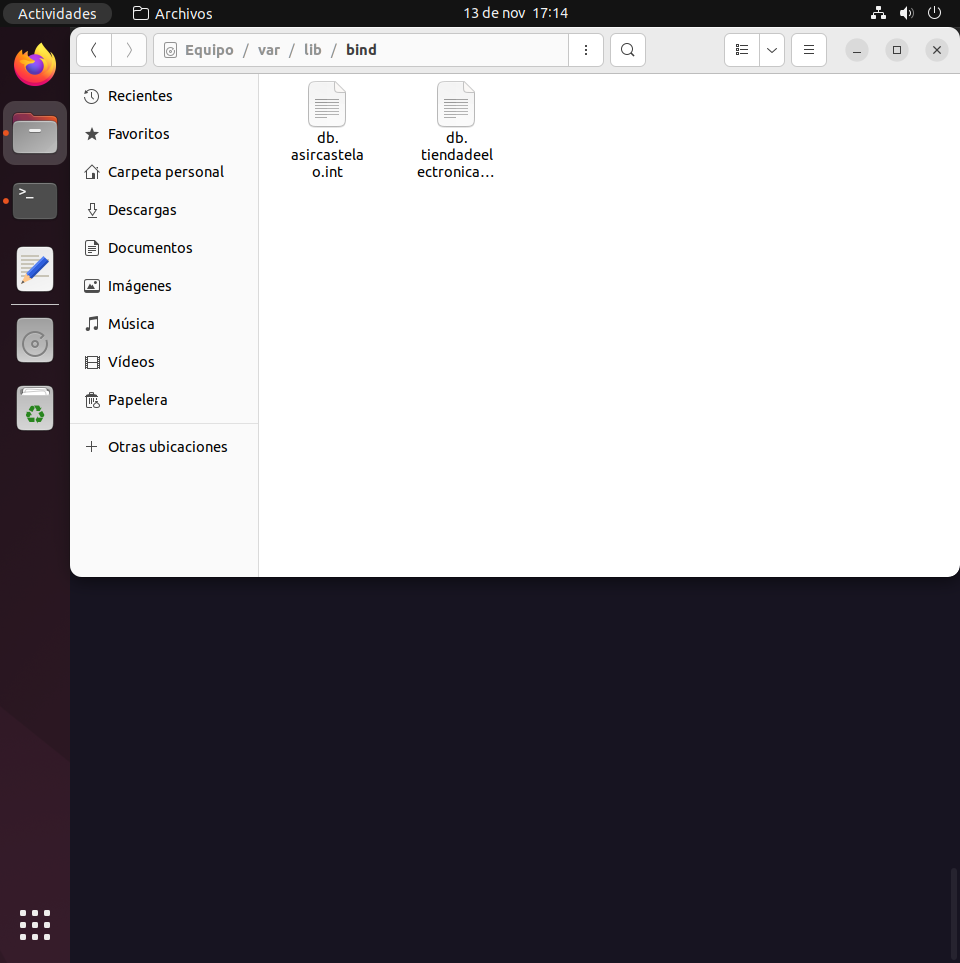
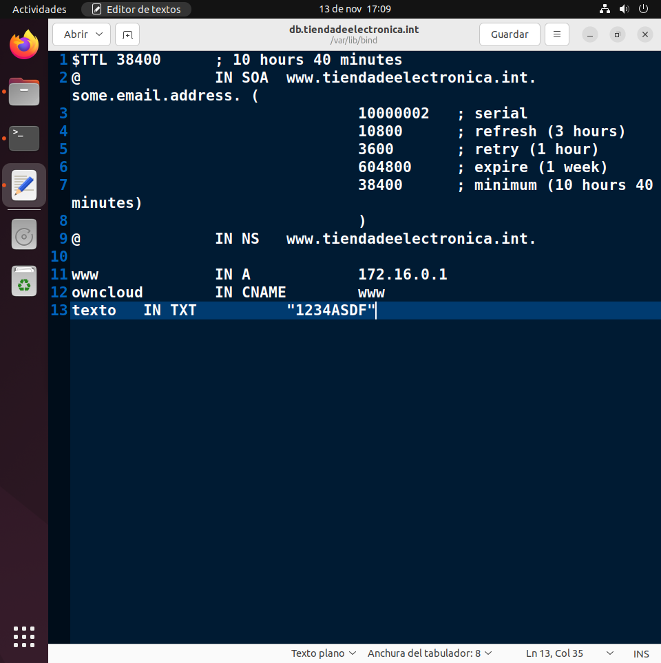

*Los ficheros de configuración son iguales para ambos apartados prácticos

Debemos reiniciar la máquina virtual para que se actualice la configuración.

Ahora consultaremos mediante el comando dig

Comprobación de *www.tiendadeelectronica.int*
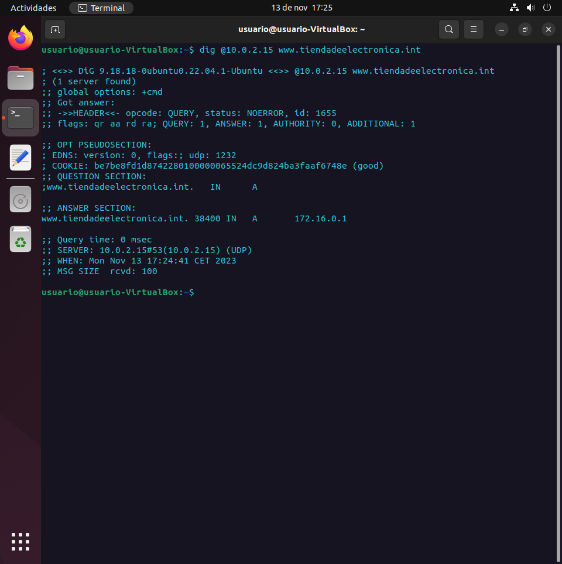

Comprobación del registro *CNAME*
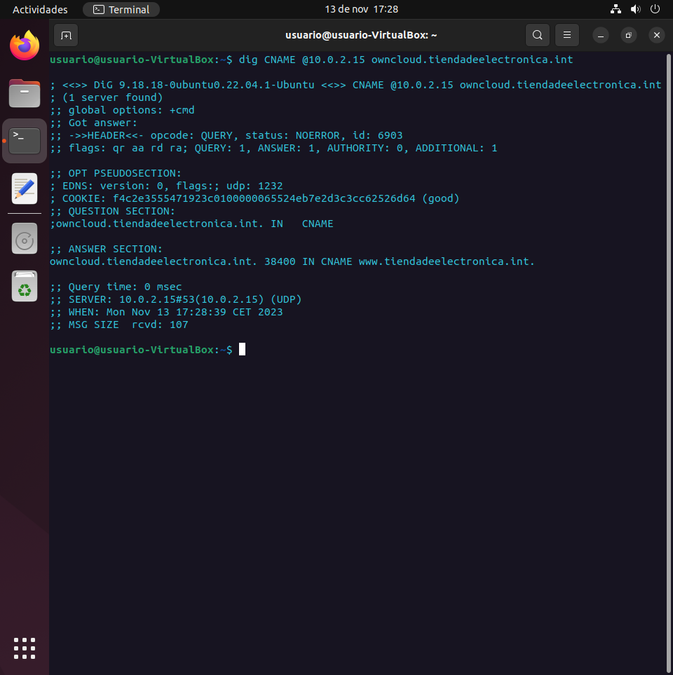

Comprobación del registro *TXT*
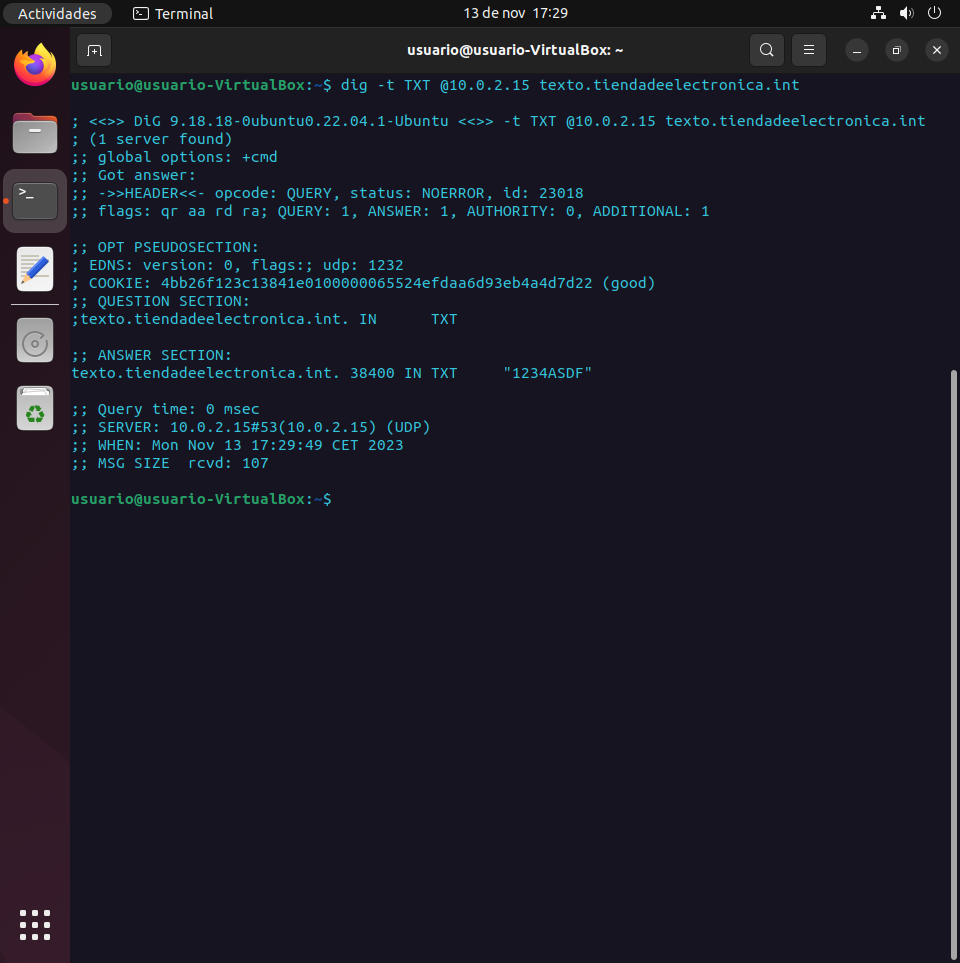

Por último, para ver los logs, haremos un cat del fichero *auth.log* que se encuentra ubicado en el directorio */var/log* para ver los logs. El comando es el siguiente:

~~~
cat /var/log/auth.log
~~~

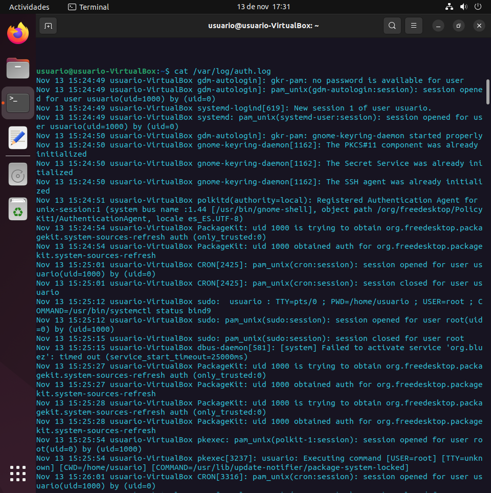

Salida por consola del comando
```
console
Nov 13 15:24:49 usuario-VirtualBox gdm-autologin]: gkr-pam: no password is available for user
Nov 13 15:24:49 usuario-VirtualBox gdm-autologin]: pam_unix(gdm-autologin:session): session opened for user usuario(uid=1000) by (uid=0)
Nov 13 15:24:49 usuario-VirtualBox systemd-logind[619]: New session 1 of user usuario.
Nov 13 15:24:49 usuario-VirtualBox systemd: pam_unix(systemd-user:session): session opened for user usuario(uid=1000) by (uid=0)
Nov 13 15:24:50 usuario-VirtualBox gdm-autologin]: gkr-pam: gnome-keyring-daemon started properly
Nov 13 15:24:50 usuario-VirtualBox gnome-keyring-daemon[1162]: The PKCS#11 component was already initialized
Nov 13 15:24:50 usuario-VirtualBox gnome-keyring-daemon[1162]: The Secret Service was already initialized
Nov 13 15:24:50 usuario-VirtualBox gnome-keyring-daemon[1162]: The SSH agent was already initialized
Nov 13 15:24:51 usuario-VirtualBox polkitd(authority=local): Registered Authentication Agent for unix-session:1 (system bus name :1.44 [/usr/bin/gnome-shell], object path /org/freedesktop/PolicyKit1/AuthenticationAgent, locale es_ES.UTF-8)
Nov 13 15:24:54 usuario-VirtualBox PackageKit: uid 1000 is trying to obtain org.freedesktop.packagekit.system-sources-refresh auth (only_trusted:0)
Nov 13 15:24:54 usuario-VirtualBox PackageKit: uid 1000 obtained auth for org.freedesktop.packagekit.system-sources-refresh
Nov 13 15:25:01 usuario-VirtualBox CRON[2425]: pam_unix(cron:session): session opened for user usuario(uid=1000) by (uid=0)
Nov 13 15:25:01 usuario-VirtualBox CRON[2425]: pam_unix(cron:session): session closed for user usuario
Nov 13 15:25:12 usuario-VirtualBox sudo:  usuario : TTY=pts/0 ; PWD=/home/usuario ; USER=root ; COMMAND=/usr/bin/systemctl status bind9
Nov 13 15:25:12 usuario-VirtualBox sudo: pam_unix(sudo:session): session opened for user root(uid=0) by (uid=1000)
Nov 13 15:25:15 usuario-VirtualBox sudo: pam_unix(sudo:session): session closed for user root
Nov 13 15:25:15 usuario-VirtualBox dbus-daemon[581]: [system] Failed to activate service 'org.bluez': timed out (service_start_timeout=25000ms)
Nov 13 15:25:27 usuario-VirtualBox PackageKit: uid 1000 is trying to obtain org.freedesktop.packagekit.system-sources-refresh auth (only_trusted:0)
Nov 13 15:25:27 usuario-VirtualBox PackageKit: uid 1000 obtained auth for org.freedesktop.packagekit.system-sources-refresh
Nov 13 15:25:28 usuario-VirtualBox PackageKit: uid 1000 is trying to obtain org.freedesktop.packagekit.system-sources-refresh auth (only_trusted:0)
Nov 13 15:25:28 usuario-VirtualBox PackageKit: uid 1000 obtained auth for org.freedesktop.packagekit.system-sources-refresh
Nov 13 15:25:54 usuario-VirtualBox pkexec: pam_unix(polkit-1:session): session opened for user root(uid=0) by (uid=1000)
Nov 13 15:25:54 usuario-VirtualBox pkexec[3237]: usuario: Executing command [USER=root] [TTY=unknown] [CWD=/home/usuario] [COMMAND=/usr/lib/update-notifier/package-system-locked]
Nov 13 15:26:01 usuario-VirtualBox CRON[3316]: pam_unix(cron:session): session opened for user usuario(uid=1000) by (uid=0)
Nov 13 15:26:01 usuario-VirtualBox CRON[3316]: pam_unix(cron:session): session closed for user usuario
Nov 13 15:27:01 usuario-VirtualBox CRON[3360]: pam_unix(cron:session): session opened for user usuario(uid=1000) by (uid=0)
Nov 13 15:27:01 usuario-VirtualBox CRON[3360]: pam_unix(cron:session): session closed for user usuario
Nov 13 15:28:01 usuario-VirtualBox CRON[3372]: pam_unix(cron:session): session opened for user usuario(uid=1000) by (uid=0)
Nov 13 15:28:01 usuario-VirtualBox CRON[3372]: pam_unix(cron:session): session closed for user usuario
Nov 13 15:29:01 usuario-VirtualBox CRON[3384]: pam_unix(cron:session): session opened for user usuario(uid=1000) by (uid=0)
Nov 13 15:29:01 usuario-VirtualBox CRON[3384]: pam_unix(cron:session): session closed for user usuario
Nov 13 15:30:01 usuario-VirtualBox CRON[3439]: pam_unix(cron:session): session opened for user root(uid=0) by (uid=0)
Nov 13 15:30:01 usuario-VirtualBox CRON[3440]: pam_unix(cron:session): session opened for user usuario(uid=1000) by (uid=0)
Nov 13 15:30:01 usuario-VirtualBox CRON[3440]: pam_unix(cron:session): session closed for user usuario
Nov 13 15:30:01 usuario-VirtualBox CRON[3439]: pam_unix(cron:session): session closed for user root
Nov 13 15:31:01 usuario-VirtualBox CRON[3457]: pam_unix(cron:session): session opened for user usuario(uid=1000) by (uid=0)
Nov 13 15:31:01 usuario-VirtualBox CRON[3457]: pam_unix(cron:session): session closed for user usuario
Nov 13 15:32:01 usuario-VirtualBox CRON[3481]: pam_unix(cron:session): session opened for user usuario(uid=1000) by (uid=0)
Nov 13 15:32:01 usuario-VirtualBox CRON[3481]: pam_unix(cron:session): session closed for user usuario
Nov 13 15:33:01 usuario-VirtualBox CRON[3494]: pam_unix(cron:session): session opened for user usuario(uid=1000) by (uid=0)
Nov 13 15:33:01 usuario-VirtualBox CRON[3494]: pam_unix(cron:session): session closed for user usuario
Nov 13 15:34:01 usuario-VirtualBox CRON[3508]: pam_unix(cron:session): session opened for user usuario(uid=1000) by (uid=0)
Nov 13 15:34:01 usuario-VirtualBox CRON[3508]: pam_unix(cron:session): session closed for user usuario
Nov 13 15:35:01 usuario-VirtualBox CRON[3531]: pam_unix(cron:session): session opened for user usuario(uid=1000) by (uid=0)
Nov 13 15:35:01 usuario-VirtualBox CRON[3531]: pam_unix(cron:session): session closed for user usuario
Nov 13 15:36:01 usuario-VirtualBox CRON[3728]: pam_unix(cron:session): session opened for user usuario(uid=1000) by (uid=0)
Nov 13 15:36:01 usuario-VirtualBox CRON[3728]: pam_unix(cron:session): session closed for user usuario
Nov 13 15:37:01 usuario-VirtualBox CRON[3740]: pam_unix(cron:session): session opened for user usuario(uid=1000) by (uid=0)
Nov 13 15:37:01 usuario-VirtualBox CRON[3740]: pam_unix(cron:session): session closed for user usuario
Nov 13 15:38:01 usuario-VirtualBox CRON[3752]: pam_unix(cron:session): session opened for user usuario(uid=1000) by (uid=0)
Nov 13 15:38:01 usuario-VirtualBox CRON[3752]: pam_unix(cron:session): session closed for user usuario
Nov 13 15:39:01 usuario-VirtualBox CRON[3764]: pam_unix(cron:session): session opened for user usuario(uid=1000) by (uid=0)
Nov 13 15:39:01 usuario-VirtualBox CRON[3764]: pam_unix(cron:session): session closed for user usuario
Nov 13 15:40:01 usuario-VirtualBox CRON[3779]: pam_unix(cron:session): session opened for user usuario(uid=1000) by (uid=0)
Nov 13 15:40:01 usuario-VirtualBox CRON[3779]: pam_unix(cron:session): session closed for user usuario
Nov 13 15:41:01 usuario-VirtualBox CRON[3791]: pam_unix(cron:session): session opened for user usuario(uid=1000) by (uid=0)
Nov 13 15:41:01 usuario-VirtualBox CRON[3791]: pam_unix(cron:session): session closed for user usuario
Nov 13 15:42:01 usuario-VirtualBox CRON[3802]: pam_unix(cron:session): session opened for user usuario(uid=1000) by (uid=0)
Nov 13 15:42:01 usuario-VirtualBox CRON[3802]: pam_unix(cron:session): session closed for user usuario
Nov 13 15:43:01 usuario-VirtualBox CRON[3816]: pam_unix(cron:session): session opened for user usuario(uid=1000) by (uid=0)
Nov 13 15:43:01 usuario-VirtualBox CRON[3816]: pam_unix(cron:session): session closed for user usuario
Nov 13 15:44:01 usuario-VirtualBox CRON[3830]: pam_unix(cron:session): session opened for user usuario(uid=1000) by (uid=0)
Nov 13 15:44:01 usuario-VirtualBox CRON[3830]: pam_unix(cron:session): session closed for user usuario
Nov 13 15:45:01 usuario-VirtualBox CRON[3843]: pam_unix(cron:session): session opened for user usuario(uid=1000) by (uid=0)
Nov 13 15:45:01 usuario-VirtualBox CRON[3843]: pam_unix(cron:session): session closed for user usuario
Nov 13 15:46:01 usuario-VirtualBox CRON[3857]: pam_unix(cron:session): session opened for user usuario(uid=1000) by (uid=0)
Nov 13 15:46:01 usuario-VirtualBox CRON[3857]: pam_unix(cron:session): session closed for user usuario
Nov 13 15:47:01 usuario-VirtualBox CRON[3868]: pam_unix(cron:session): session opened for user usuario(uid=1000) by (uid=0)
Nov 13 15:47:01 usuario-VirtualBox CRON[3868]: pam_unix(cron:session): session closed for user usuario
Nov 13 15:48:01 usuario-VirtualBox CRON[3880]: pam_unix(cron:session): session opened for user usuario(uid=1000) by (uid=0)
Nov 13 15:48:01 usuario-VirtualBox CRON[3880]: pam_unix(cron:session): session closed for user usuario
Nov 13 15:49:01 usuario-VirtualBox CRON[3894]: pam_unix(cron:session): session opened for user usuario(uid=1000) by (uid=0)
Nov 13 15:49:01 usuario-VirtualBox CRON[3894]: pam_unix(cron:session): session closed for user usuario
Nov 13 15:50:01 usuario-VirtualBox CRON[3906]: pam_unix(cron:session): session opened for user usuario(uid=1000) by (uid=0)
Nov 13 15:50:01 usuario-VirtualBox CRON[3906]: pam_unix(cron:session): session closed for user usuario
Nov 13 15:51:01 usuario-VirtualBox CRON[3920]: pam_unix(cron:session): session opened for user usuario(uid=1000) by (uid=0)
Nov 13 15:51:01 usuario-VirtualBox CRON[3920]: pam_unix(cron:session): session closed for user usuario
Nov 13 15:52:01 usuario-VirtualBox CRON[3932]: pam_unix(cron:session): session opened for user usuario(uid=1000) by (uid=0)
Nov 13 15:52:01 usuario-VirtualBox CRON[3932]: pam_unix(cron:session): session closed for user usuario
Nov 13 15:53:01 usuario-VirtualBox CRON[3944]: pam_unix(cron:session): session opened for user usuario(uid=1000) by (uid=0)
Nov 13 15:53:01 usuario-VirtualBox CRON[3944]: pam_unix(cron:session): session closed for user usuario
Nov 13 15:54:01 usuario-VirtualBox CRON[3957]: pam_unix(cron:session): session opened for user usuario(uid=1000) by (uid=0)
Nov 13 15:54:01 usuario-VirtualBox CRON[3957]: pam_unix(cron:session): session closed for user usuario
Nov 13 15:55:01 usuario-VirtualBox CRON[3972]: pam_unix(cron:session): session opened for user usuario(uid=1000) by (uid=0)
Nov 13 15:55:01 usuario-VirtualBox CRON[3972]: pam_unix(cron:session): session closed for user usuario
Nov 13 15:56:01 usuario-VirtualBox CRON[3994]: pam_unix(cron:session): session opened for user usuario(uid=1000) by (uid=0)
Nov 13 15:56:01 usuario-VirtualBox CRON[3994]: pam_unix(cron:session): session closed for user usuario
Nov 13 15:57:01 usuario-VirtualBox CRON[4006]: pam_unix(cron:session): session opened for user usuario(uid=1000) by (uid=0)
Nov 13 15:57:01 usuario-VirtualBox CRON[4006]: pam_unix(cron:session): session closed for user usuario
Nov 13 15:58:01 usuario-VirtualBox CRON[4017]: pam_unix(cron:session): session opened for user usuario(uid=1000) by (uid=0)
Nov 13 15:58:01 usuario-VirtualBox CRON[4017]: pam_unix(cron:session): session closed for user usuario
Nov 13 15:59:01 usuario-VirtualBox CRON[4030]: pam_unix(cron:session): session opened for user usuario(uid=1000) by (uid=0)
Nov 13 15:59:01 usuario-VirtualBox CRON[4030]: pam_unix(cron:session): session closed for user usuario
Nov 13 16:00:01 usuario-VirtualBox CRON[4042]: pam_unix(cron:session): session opened for user usuario(uid=1000) by (uid=0)
Nov 13 16:00:01 usuario-VirtualBox CRON[4042]: pam_unix(cron:session): session closed for user usuario
Nov 13 16:01:01 usuario-VirtualBox CRON[4055]: pam_unix(cron:session): session opened for user usuario(uid=1000) by (uid=0)
Nov 13 16:01:01 usuario-VirtualBox CRON[4055]: pam_unix(cron:session): session closed for user usuario
Nov 13 16:02:01 usuario-VirtualBox CRON[4068]: pam_unix(cron:session): session opened for user usuario(uid=1000) by (uid=0)
Nov 13 16:02:01 usuario-VirtualBox CRON[4068]: pam_unix(cron:session): session closed for user usuario
Nov 13 16:03:01 usuario-VirtualBox CRON[4293]: pam_unix(cron:session): session opened for user usuario(uid=1000) by (uid=0)
Nov 13 16:03:01 usuario-VirtualBox CRON[4293]: pam_unix(cron:session): session closed for user usuario
Nov 13 16:04:01 usuario-VirtualBox CRON[4306]: pam_unix(cron:session): session opened for user usuario(uid=1000) by (uid=0)
Nov 13 16:04:01 usuario-VirtualBox CRON[4306]: pam_unix(cron:session): session closed for user usuario
Nov 13 16:04:53 usuario-VirtualBox pkexec: pam_unix(polkit-1:session): session opened for user root(uid=0) by (uid=1000)
Nov 13 16:04:53 usuario-VirtualBox pkexec[4348]: usuario: Executing command [USER=root] [TTY=unknown] [CWD=/home/usuario] [COMMAND=/usr/lib/update-notifier/package-system-locked]
Nov 13 16:05:01 usuario-VirtualBox CRON[4357]: pam_unix(cron:session): session opened for user usuario(uid=1000) by (uid=0)
Nov 13 16:05:01 usuario-VirtualBox CRON[4357]: pam_unix(cron:session): session closed for user usuario
Nov 13 16:06:02 usuario-VirtualBox CRON[4369]: pam_unix(cron:session): session opened for user usuario(uid=1000) by (uid=0)
Nov 13 16:06:02 usuario-VirtualBox CRON[4369]: pam_unix(cron:session): session closed for user usuario
Nov 13 16:07:01 usuario-VirtualBox CRON[4383]: pam_unix(cron:session): session opened for user usuario(uid=1000) by (uid=0)
Nov 13 16:07:01 usuario-VirtualBox CRON[4383]: pam_unix(cron:session): session closed for user usuario
Nov 13 16:08:01 usuario-VirtualBox CRON[4395]: pam_unix(cron:session): session opened for user usuario(uid=1000) by (uid=0)
Nov 13 16:08:01 usuario-VirtualBox CRON[4395]: pam_unix(cron:session): session closed for user usuario
Nov 13 16:09:01 usuario-VirtualBox CRON[4408]: pam_unix(cron:session): session opened for user usuario(uid=1000) by (uid=0)
Nov 13 16:09:01 usuario-VirtualBox CRON[4408]: pam_unix(cron:session): session closed for user usuario
Nov 13 16:10:01 usuario-VirtualBox CRON[4420]: pam_unix(cron:session): session opened for user usuario(uid=1000) by (uid=0)
Nov 13 16:10:01 usuario-VirtualBox CRON[4420]: pam_unix(cron:session): session closed for user usuario
Nov 13 16:11:01 usuario-VirtualBox CRON[4434]: pam_unix(cron:session): session opened for user usuario(uid=1000) by (uid=0)
Nov 13 16:11:01 usuario-VirtualBox CRON[4434]: pam_unix(cron:session): session closed for user usuario
Nov 13 16:12:01 usuario-VirtualBox CRON[4447]: pam_unix(cron:session): session opened for user usuario(uid=1000) by (uid=0)
Nov 13 16:12:01 usuario-VirtualBox CRON[4447]: pam_unix(cron:session): session closed for user usuario
Nov 13 16:13:01 usuario-VirtualBox CRON[4459]: pam_unix(cron:session): session opened for user usuario(uid=1000) by (uid=0)
Nov 13 16:13:01 usuario-VirtualBox CRON[4459]: pam_unix(cron:session): session closed for user usuario
Nov 13 16:14:01 usuario-VirtualBox CRON[4471]: pam_unix(cron:session): session opened for user usuario(uid=1000) by (uid=0)
Nov 13 16:14:01 usuario-VirtualBox CRON[4471]: pam_unix(cron:session): session closed for user usuario
Nov 13 16:15:01 usuario-VirtualBox CRON[4484]: pam_unix(cron:session): session opened for user usuario(uid=1000) by (uid=0)
Nov 13 16:15:01 usuario-VirtualBox CRON[4484]: pam_unix(cron:session): session closed for user usuario
Nov 13 16:16:01 usuario-VirtualBox CRON[4498]: pam_unix(cron:session): session opened for user usuario(uid=1000) by (uid=0)
Nov 13 16:16:01 usuario-VirtualBox CRON[4498]: pam_unix(cron:session): session closed for user usuario
Nov 13 16:17:01 usuario-VirtualBox CRON[4510]: pam_unix(cron:session): session opened for user root(uid=0) by (uid=0)
Nov 13 16:17:01 usuario-VirtualBox CRON[4511]: pam_unix(cron:session): session opened for user usuario(uid=1000) by (uid=0)
Nov 13 16:17:01 usuario-VirtualBox CRON[4511]: pam_unix(cron:session): session closed for user usuario
Nov 13 16:17:01 usuario-VirtualBox CRON[4510]: pam_unix(cron:session): session closed for user root
Nov 13 16:18:01 usuario-VirtualBox CRON[4525]: pam_unix(cron:session): session opened for user usuario(uid=1000) by (uid=0)
Nov 13 16:18:01 usuario-VirtualBox CRON[4525]: pam_unix(cron:session): session closed for user usuario
Nov 13 16:19:01 usuario-VirtualBox CRON[4538]: pam_unix(cron:session): session opened for user usuario(uid=1000) by (uid=0)
Nov 13 16:19:01 usuario-VirtualBox CRON[4538]: pam_unix(cron:session): session closed for user usuario
Nov 13 16:20:01 usuario-VirtualBox CRON[4550]: pam_unix(cron:session): session opened for user usuario(uid=1000) by (uid=0)
Nov 13 16:20:01 usuario-VirtualBox CRON[4550]: pam_unix(cron:session): session closed for user usuario
Nov 13 16:21:01 usuario-VirtualBox CRON[4562]: pam_unix(cron:session): session opened for user usuario(uid=1000) by (uid=0)
Nov 13 16:21:01 usuario-VirtualBox CRON[4562]: pam_unix(cron:session): session closed for user usuario
Nov 13 16:22:01 usuario-VirtualBox CRON[4576]: pam_unix(cron:session): session opened for user usuario(uid=1000) by (uid=0)
Nov 13 16:22:01 usuario-VirtualBox CRON[4576]: pam_unix(cron:session): session closed for user usuario
Nov 13 16:23:01 usuario-VirtualBox CRON[4588]: pam_unix(cron:session): session opened for user usuario(uid=1000) by (uid=0)
Nov 13 16:23:01 usuario-VirtualBox CRON[4588]: pam_unix(cron:session): session closed for user usuario
Nov 13 16:24:01 usuario-VirtualBox CRON[4602]: pam_unix(cron:session): session opened for user usuario(uid=1000) by (uid=0)
Nov 13 16:24:01 usuario-VirtualBox CRON[4602]: pam_unix(cron:session): session closed for user usuario
Nov 13 16:25:01 usuario-VirtualBox CRON[4626]: pam_unix(cron:session): session opened for user usuario(uid=1000) by (uid=0)
Nov 13 16:25:01 usuario-VirtualBox CRON[4626]: pam_unix(cron:session): session closed for user usuario
Nov 13 16:26:01 usuario-VirtualBox CRON[4640]: pam_unix(cron:session): session opened for user usuario(uid=1000) by (uid=0)
Nov 13 16:26:01 usuario-VirtualBox CRON[4640]: pam_unix(cron:session): session closed for user usuario
Nov 13 16:27:01 usuario-VirtualBox CRON[4652]: pam_unix(cron:session): session opened for user usuario(uid=1000) by (uid=0)
Nov 13 16:27:01 usuario-VirtualBox CRON[4652]: pam_unix(cron:session): session closed for user usuario
Nov 13 16:28:01 usuario-VirtualBox CRON[4664]: pam_unix(cron:session): session opened for user usuario(uid=1000) by (uid=0)
Nov 13 16:28:01 usuario-VirtualBox CRON[4664]: pam_unix(cron:session): session closed for user usuario
Nov 13 16:29:01 usuario-VirtualBox CRON[4677]: pam_unix(cron:session): session opened for user usuario(uid=1000) by (uid=0)
Nov 13 16:29:01 usuario-VirtualBox CRON[4677]: pam_unix(cron:session): session closed for user usuario
Nov 13 16:30:01 usuario-VirtualBox CRON[4689]: pam_unix(cron:session): session opened for user root(uid=0) by (uid=0)
Nov 13 16:30:01 usuario-VirtualBox CRON[4690]: pam_unix(cron:session): session opened for user usuario(uid=1000) by (uid=0)
Nov 13 16:30:01 usuario-VirtualBox CRON[4690]: pam_unix(cron:session): session closed for user usuario
Nov 13 16:30:01 usuario-VirtualBox CRON[4689]: pam_unix(cron:session): session closed for user root
Nov 13 16:31:01 usuario-VirtualBox CRON[4702]: pam_unix(cron:session): session opened for user usuario(uid=1000) by (uid=0)
Nov 13 16:31:01 usuario-VirtualBox CRON[4702]: pam_unix(cron:session): session closed for user usuario
Nov 13 16:32:01 usuario-VirtualBox CRON[4716]: pam_unix(cron:session): session opened for user usuario(uid=1000) by (uid=0)
Nov 13 16:32:01 usuario-VirtualBox CRON[4716]: pam_unix(cron:session): session closed for user usuario
Nov 13 16:33:01 usuario-VirtualBox CRON[4729]: pam_unix(cron:session): session opened for user usuario(uid=1000) by (uid=0)
Nov 13 16:33:01 usuario-VirtualBox CRON[4729]: pam_unix(cron:session): session closed for user usuario
Nov 13 16:34:01 usuario-VirtualBox CRON[4742]: pam_unix(cron:session): session opened for user usuario(uid=1000) by (uid=0)
Nov 13 16:34:01 usuario-VirtualBox CRON[4742]: pam_unix(cron:session): session closed for user usuario
Nov 13 16:35:01 usuario-VirtualBox CRON[4757]: pam_unix(cron:session): session opened for user usuario(uid=1000) by (uid=0)
Nov 13 16:35:01 usuario-VirtualBox CRON[4757]: pam_unix(cron:session): session closed for user usuario
Nov 13 16:36:01 usuario-VirtualBox CRON[4777]: pam_unix(cron:session): session opened for user usuario(uid=1000) by (uid=0)
Nov 13 16:36:01 usuario-VirtualBox CRON[4777]: pam_unix(cron:session): session closed for user usuario
Nov 13 16:37:01 usuario-VirtualBox CRON[4789]: pam_unix(cron:session): session opened for user usuario(uid=1000) by (uid=0)
Nov 13 16:37:01 usuario-VirtualBox CRON[4789]: pam_unix(cron:session): session closed for user usuario
Nov 13 16:38:01 usuario-VirtualBox CRON[4800]: pam_unix(cron:session): session opened for user usuario(uid=1000) by (uid=0)
Nov 13 16:38:01 usuario-VirtualBox CRON[4800]: pam_unix(cron:session): session closed for user usuario
Nov 13 16:39:01 usuario-VirtualBox CRON[4813]: pam_unix(cron:session): session opened for user usuario(uid=1000) by (uid=0)
Nov 13 16:39:01 usuario-VirtualBox CRON[4813]: pam_unix(cron:session): session closed for user usuario
Nov 13 16:40:01 usuario-VirtualBox CRON[4825]: pam_unix(cron:session): session opened for user usuario(uid=1000) by (uid=0)
Nov 13 16:40:01 usuario-VirtualBox CRON[4825]: pam_unix(cron:session): session closed for user usuario
Nov 13 16:41:01 usuario-VirtualBox CRON[4837]: pam_unix(cron:session): session opened for user usuario(uid=1000) by (uid=0)
Nov 13 16:41:01 usuario-VirtualBox CRON[4837]: pam_unix(cron:session): session closed for user usuario
Nov 13 16:42:01 usuario-VirtualBox CRON[4850]: pam_unix(cron:session): session opened for user usuario(uid=1000) by (uid=0)
Nov 13 16:42:01 usuario-VirtualBox CRON[4850]: pam_unix(cron:session): session closed for user usuario
Nov 13 16:43:01 usuario-VirtualBox CRON[4861]: pam_unix(cron:session): session opened for user usuario(uid=1000) by (uid=0)
Nov 13 16:43:01 usuario-VirtualBox CRON[4861]: pam_unix(cron:session): session closed for user usuario
Nov 13 16:44:01 usuario-VirtualBox CRON[4873]: pam_unix(cron:session): session opened for user usuario(uid=1000) by (uid=0)
Nov 13 16:44:01 usuario-VirtualBox CRON[4873]: pam_unix(cron:session): session closed for user usuario
Nov 13 16:45:01 usuario-VirtualBox CRON[4886]: pam_unix(cron:session): session opened for user usuario(uid=1000) by (uid=0)
Nov 13 16:45:01 usuario-VirtualBox CRON[4886]: pam_unix(cron:session): session closed for user usuario
Nov 13 16:46:01 usuario-VirtualBox CRON[4897]: pam_unix(cron:session): session opened for user usuario(uid=1000) by (uid=0)
Nov 13 16:46:01 usuario-VirtualBox CRON[4897]: pam_unix(cron:session): session closed for user usuario
Nov 13 16:47:01 usuario-VirtualBox CRON[4911]: pam_unix(cron:session): session opened for user usuario(uid=1000) by (uid=0)
Nov 13 16:47:01 usuario-VirtualBox CRON[4911]: pam_unix(cron:session): session closed for user usuario
Nov 13 16:48:01 usuario-VirtualBox CRON[4923]: pam_unix(cron:session): session opened for user usuario(uid=1000) by (uid=0)
Nov 13 16:48:01 usuario-VirtualBox CRON[4923]: pam_unix(cron:session): session closed for user usuario
Nov 13 16:49:01 usuario-VirtualBox CRON[4936]: pam_unix(cron:session): session opened for user usuario(uid=1000) by (uid=0)
Nov 13 16:49:01 usuario-VirtualBox CRON[4936]: pam_unix(cron:session): session closed for user usuario
Nov 13 16:50:01 usuario-VirtualBox CRON[4949]: pam_unix(cron:session): session opened for user usuario(uid=1000) by (uid=0)
Nov 13 16:50:01 usuario-VirtualBox CRON[4949]: pam_unix(cron:session): session closed for user usuario
Nov 13 16:51:02 usuario-VirtualBox CRON[4962]: pam_unix(cron:session): session opened for user usuario(uid=1000) by (uid=0)
Nov 13 16:51:02 usuario-VirtualBox CRON[4962]: pam_unix(cron:session): session closed for user usuario
Nov 13 16:52:01 usuario-VirtualBox CRON[4974]: pam_unix(cron:session): session opened for user usuario(uid=1000) by (uid=0)
Nov 13 16:52:01 usuario-VirtualBox CRON[4974]: pam_unix(cron:session): session closed for user usuario
Nov 13 16:53:01 usuario-VirtualBox CRON[4985]: pam_unix(cron:session): session opened for user usuario(uid=1000) by (uid=0)
Nov 13 16:53:01 usuario-VirtualBox CRON[4985]: pam_unix(cron:session): session closed for user usuario
Nov 13 16:54:01 usuario-VirtualBox CRON[4999]: pam_unix(cron:session): session opened for user usuario(uid=1000) by (uid=0)
Nov 13 16:54:01 usuario-VirtualBox CRON[4999]: pam_unix(cron:session): session closed for user usuario
Nov 13 16:55:01 usuario-VirtualBox CRON[5012]: pam_unix(cron:session): session opened for user usuario(uid=1000) by (uid=0)
Nov 13 16:55:01 usuario-VirtualBox CRON[5012]: pam_unix(cron:session): session closed for user usuario
Nov 13 16:56:01 usuario-VirtualBox CRON[5023]: pam_unix(cron:session): session opened for user usuario(uid=1000) by (uid=0)
Nov 13 16:56:01 usuario-VirtualBox CRON[5023]: pam_unix(cron:session): session closed for user usuario
Nov 13 16:57:01 usuario-VirtualBox CRON[5036]: pam_unix(cron:session): session opened for user usuario(uid=1000) by (uid=0)
Nov 13 16:57:01 usuario-VirtualBox CRON[5036]: pam_unix(cron:session): session closed for user usuario
Nov 13 16:58:01 usuario-VirtualBox CRON[5048]: pam_unix(cron:session): session opened for user usuario(uid=1000) by (uid=0)
Nov 13 16:58:01 usuario-VirtualBox CRON[5048]: pam_unix(cron:session): session closed for user usuario
Nov 13 16:59:01 usuario-VirtualBox CRON[5061]: pam_unix(cron:session): session opened for user usuario(uid=1000) by (uid=0)
Nov 13 16:59:01 usuario-VirtualBox CRON[5061]: pam_unix(cron:session): session closed for user usuario
Nov 13 17:00:01 usuario-VirtualBox CRON[5073]: pam_unix(cron:session): session opened for user usuario(uid=1000) by (uid=0)
Nov 13 17:00:01 usuario-VirtualBox CRON[5073]: pam_unix(cron:session): session closed for user usuario
Nov 13 17:01:01 usuario-VirtualBox CRON[5085]: pam_unix(cron:session): session opened for user usuario(uid=1000) by (uid=0)
Nov 13 17:01:01 usuario-VirtualBox CRON[5085]: pam_unix(cron:session): session closed for user usuario
Nov 13 17:02:01 usuario-VirtualBox CRON[5098]: pam_unix(cron:session): session opened for user usuario(uid=1000) by (uid=0)
Nov 13 17:02:01 usuario-VirtualBox CRON[5098]: pam_unix(cron:session): session closed for user usuario
Nov 13 17:03:01 usuario-VirtualBox CRON[5111]: pam_unix(cron:session): session opened for user usuario(uid=1000) by (uid=0)
Nov 13 17:03:01 usuario-VirtualBox CRON[5111]: pam_unix(cron:session): session closed for user usuario
Nov 13 17:04:01 usuario-VirtualBox CRON[5124]: pam_unix(cron:session): session opened for user usuario(uid=1000) by (uid=0)
Nov 13 17:04:01 usuario-VirtualBox CRON[5124]: pam_unix(cron:session): session closed for user usuario
Nov 13 17:05:01 usuario-VirtualBox CRON[5137]: pam_unix(cron:session): session opened for user usuario(uid=1000) by (uid=0)
Nov 13 17:05:01 usuario-VirtualBox CRON[5137]: pam_unix(cron:session): session closed for user usuario
Nov 13 17:06:01 usuario-VirtualBox CRON[5149]: pam_unix(cron:session): session opened for user usuario(uid=1000) by (uid=0)
Nov 13 17:06:01 usuario-VirtualBox CRON[5149]: pam_unix(cron:session): session closed for user usuario
Nov 13 17:06:25 usuario-VirtualBox gdm-password]: gkr-pam: unlocked login keyring
Nov 13 17:06:51 usuario-VirtualBox sudo: pam_unix(sudo:auth): authentication failure; logname= uid=1000 euid=0 tty=/dev/pts/0 ruser=usuario rhost=  user=usuario
Nov 13 17:07:01 usuario-VirtualBox CRON[5250]: pam_unix(cron:session): session opened for user usuario(uid=1000) by (uid=0)
Nov 13 17:07:01 usuario-VirtualBox CRON[5250]: pam_unix(cron:session): session closed for user usuario
Nov 13 17:07:04 usuario-VirtualBox sudo:  usuario : TTY=pts/0 ; PWD=/home/usuario ; USER=root ; COMMAND=/usr/bin/systemctl status bind9
Nov 13 17:07:04 usuario-VirtualBox sudo: pam_unix(sudo:session): session opened for user root(uid=0) by (uid=1000)
Nov 13 17:07:07 usuario-VirtualBox sudo: pam_unix(sudo:session): session closed for user root
Nov 13 17:07:23 usuario-VirtualBox su: (to root) usuario on pts/0
Nov 13 17:07:23 usuario-VirtualBox su: pam_unix(su-l:session): session opened for user root(uid=0) by (uid=1000)
Nov 13 17:08:01 usuario-VirtualBox CRON[5316]: pam_unix(cron:session): session opened for user usuario(uid=1000) by (uid=0)
Nov 13 17:08:01 usuario-VirtualBox CRON[5316]: pam_unix(cron:session): session closed for user usuario
Nov 13 17:09:01 usuario-VirtualBox CRON[5413]: pam_unix(cron:session): session opened for user usuario(uid=1000) by (uid=0)
Nov 13 17:09:01 usuario-VirtualBox CRON[5413]: pam_unix(cron:session): session closed for user usuario
Nov 13 17:10:01 usuario-VirtualBox CRON[5505]: pam_unix(cron:session): session opened for user usuario(uid=1000) by (uid=0)
Nov 13 17:10:01 usuario-VirtualBox CRON[5505]: pam_unix(cron:session): session closed for user usuario
Nov 13 17:11:01 usuario-VirtualBox CRON[5558]: pam_unix(cron:session): session opened for user usuario(uid=1000) by (uid=0)
Nov 13 17:11:01 usuario-VirtualBox CRON[5558]: pam_unix(cron:session): session closed for user usuario
Nov 13 17:12:01 usuario-VirtualBox CRON[5618]: pam_unix(cron:session): session opened for user usuario(uid=1000) by (uid=0)
Nov 13 17:12:01 usuario-VirtualBox CRON[5618]: pam_unix(cron:session): session closed for user usuario
Nov 13 17:13:01 usuario-VirtualBox CRON[5633]: pam_unix(cron:session): session opened for user usuario(uid=1000) by (uid=0)
Nov 13 17:13:01 usuario-VirtualBox CRON[5633]: pam_unix(cron:session): session closed for user usuario
Nov 13 17:14:01 usuario-VirtualBox CRON[5645]: pam_unix(cron:session): session opened for user usuario(uid=1000) by (uid=0)
Nov 13 17:14:01 usuario-VirtualBox CRON[5645]: pam_unix(cron:session): session closed for user usuario
Nov 13 17:15:01 usuario-VirtualBox CRON[5663]: pam_unix(cron:session): session opened for user usuario(uid=1000) by (uid=0)
Nov 13 17:15:01 usuario-VirtualBox CRON[5663]: pam_unix(cron:session): session closed for user usuario
Nov 13 17:15:17 usuario-VirtualBox su: pam_unix(su-l:session): session closed for user root
Nov 13 17:16:01 usuario-VirtualBox CRON[5708]: pam_unix(cron:session): session opened for user usuario(uid=1000) by (uid=0)
Nov 13 17:16:01 usuario-VirtualBox CRON[5708]: pam_unix(cron:session): session closed for user usuario
Nov 13 17:17:01 usuario-VirtualBox CRON[5804]: pam_unix(cron:session): session opened for user root(uid=0) by (uid=0)
Nov 13 17:17:01 usuario-VirtualBox CRON[5805]: pam_unix(cron:session): session opened for user usuario(uid=1000) by (uid=0)
Nov 13 17:17:01 usuario-VirtualBox CRON[5805]: pam_unix(cron:session): session closed for user usuario
Nov 13 17:17:01 usuario-VirtualBox CRON[5804]: pam_unix(cron:session): session closed for user root
Nov 13 17:18:01 usuario-VirtualBox CRON[5902]: pam_unix(cron:session): session opened for user usuario(uid=1000) by (uid=0)
Nov 13 17:18:01 usuario-VirtualBox CRON[5902]: pam_unix(cron:session): session closed for user usuario
Nov 13 17:18:22 usuario-VirtualBox sudo:  usuario : TTY=pts/0 ; PWD=/home/usuario ; USER=root ; COMMAND=/usr/sbin/reboot
Nov 13 17:18:22 usuario-VirtualBox sudo: pam_unix(sudo:session): session opened for user root(uid=0) by (uid=1000)
Nov 13 17:18:22 usuario-VirtualBox sudo: pam_unix(sudo:session): session closed for user root
Nov 13 17:18:28 usuario-VirtualBox systemd-logind[626]: New seat seat0.
Nov 13 17:18:28 usuario-VirtualBox systemd-logind[626]: Watching system buttons on /dev/input/event0 (Power Button)
Nov 13 17:18:28 usuario-VirtualBox systemd-logind[626]: Watching system buttons on /dev/input/event1 (Sleep Button)
Nov 13 17:18:28 usuario-VirtualBox systemd-logind[626]: Watching system buttons on /dev/input/event2 (AT Translated Set 2 keyboard)
Nov 13 17:18:30 usuario-VirtualBox gdm-autologin]: gkr-pam: no password is available for user
Nov 13 17:18:30 usuario-VirtualBox gdm-autologin]: pam_unix(gdm-autologin:session): session opened for user usuario(uid=1000) by (uid=0)
Nov 13 17:18:30 usuario-VirtualBox systemd-logind[626]: New session 1 of user usuario.
Nov 13 17:18:30 usuario-VirtualBox systemd: pam_unix(systemd-user:session): session opened for user usuario(uid=1000) by (uid=0)
Nov 13 17:18:30 usuario-VirtualBox gdm-autologin]: gkr-pam: gnome-keyring-daemon started properly
Nov 13 17:18:30 usuario-VirtualBox gnome-keyring-daemon[1075]: The Secret Service was already initialized
Nov 13 17:18:30 usuario-VirtualBox gnome-keyring-daemon[1075]: The SSH agent was already initialized
Nov 13 17:18:30 usuario-VirtualBox gnome-keyring-daemon[1075]: The PKCS#11 component was already initialized
Nov 13 17:18:31 usuario-VirtualBox polkitd(authority=local): Registered Authentication Agent for unix-session:1 (system bus name :1.38 [/usr/bin/gnome-shell], object path /org/freedesktop/PolicyKit1/AuthenticationAgent, locale es_ES.UTF-8)
Nov 13 17:18:34 usuario-VirtualBox PackageKit: uid 1000 is trying to obtain org.freedesktop.packagekit.system-sources-refresh auth (only_trusted:0)
Nov 13 17:18:34 usuario-VirtualBox PackageKit: uid 1000 obtained auth for org.freedesktop.packagekit.system-sources-refresh
Nov 13 17:18:38 usuario-VirtualBox PackageKit: uid 1000 is trying to obtain org.freedesktop.packagekit.system-sources-refresh auth (only_trusted:0)
Nov 13 17:18:38 usuario-VirtualBox PackageKit: uid 1000 obtained auth for org.freedesktop.packagekit.system-sources-refresh
Nov 13 17:18:40 usuario-VirtualBox PackageKit: uid 1000 is trying to obtain org.freedesktop.packagekit.system-sources-refresh auth (only_trusted:0)
Nov 13 17:18:40 usuario-VirtualBox PackageKit: uid 1000 obtained auth for org.freedesktop.packagekit.system-sources-refresh
Nov 13 17:18:55 usuario-VirtualBox dbus-daemon[582]: [system] Failed to activate service 'org.bluez': timed out (service_start_timeout=25000ms)
Nov 13 17:19:01 usuario-VirtualBox CRON[2955]: pam_unix(cron:session): session opened for user usuario(uid=1000) by (uid=0)
Nov 13 17:19:01 usuario-VirtualBox CRON[2955]: pam_unix(cron:session): session closed for user usuario
Nov 13 17:19:34 usuario-VirtualBox pkexec: pam_unix(polkit-1:session): session opened for user root(uid=0) by (uid=1000)
Nov 13 17:19:34 usuario-VirtualBox pkexec[3033]: usuario: Executing command [USER=root] [TTY=unknown] [CWD=/home/usuario] [COMMAND=/usr/lib/update-notifier/package-system-locked]
Nov 13 17:20:01 usuario-VirtualBox CRON[3047]: pam_unix(cron:session): session opened for user usuario(uid=1000) by (uid=0)
Nov 13 17:20:01 usuario-VirtualBox CRON[3047]: pam_unix(cron:session): session closed for user usuario
Nov 13 17:21:01 usuario-VirtualBox CRON[3071]: pam_unix(cron:session): session opened for user usuario(uid=1000) by (uid=0)
Nov 13 17:21:01 usuario-VirtualBox CRON[3071]: pam_unix(cron:session): session closed for user usuario
Nov 13 17:22:01 usuario-VirtualBox CRON[3169]: pam_unix(cron:session): session opened for user usuario(uid=1000) by (uid=0)
Nov 13 17:22:01 usuario-VirtualBox CRON[3169]: pam_unix(cron:session): session closed for user usuario
Nov 13 17:23:01 usuario-VirtualBox CRON[3186]: pam_unix(cron:session): session opened for user usuario(uid=1000) by (uid=0)
Nov 13 17:23:01 usuario-VirtualBox CRON[3186]: pam_unix(cron:session): session closed for user usuario
Nov 13 17:23:55 usuario-VirtualBox sudo: pam_unix(sudo:auth): authentication failure; logname= uid=1000 euid=0 tty=/dev/pts/0 ruser=usuario rhost=  user=usuario
Nov 13 17:24:01 usuario-VirtualBox sudo:  usuario : TTY=pts/0 ; PWD=/home/usuario ; USER=root ; COMMAND=/usr/sbin/reboot
Nov 13 17:24:01 usuario-VirtualBox sudo: pam_unix(sudo:session): session opened for user root(uid=0) by (uid=1000)
Nov 13 17:24:01 usuario-VirtualBox sudo: pam_unix(sudo:session): session closed for user root
Nov 13 17:24:10 usuario-VirtualBox systemd-logind[630]: New seat seat0.
Nov 13 17:24:10 usuario-VirtualBox systemd-logind[630]: Watching system buttons on /dev/input/event0 (Power Button)
Nov 13 17:24:10 usuario-VirtualBox systemd-logind[630]: Watching system buttons on /dev/input/event1 (Sleep Button)
Nov 13 17:24:10 usuario-VirtualBox systemd-logind[630]: Watching system buttons on /dev/input/event2 (AT Translated Set 2 keyboard)
Nov 13 17:24:11 usuario-VirtualBox gdm-autologin]: gkr-pam: no password is available for user
Nov 13 17:24:11 usuario-VirtualBox gdm-autologin]: pam_unix(gdm-autologin:session): session opened for user usuario(uid=1000) by (uid=0)
Nov 13 17:24:11 usuario-VirtualBox systemd-logind[630]: New session 1 of user usuario.
Nov 13 17:24:11 usuario-VirtualBox systemd: pam_unix(systemd-user:session): session opened for user usuario(uid=1000) by (uid=0)
Nov 13 17:24:11 usuario-VirtualBox gdm-autologin]: gkr-pam: gnome-keyring-daemon started properly
Nov 13 17:24:11 usuario-VirtualBox gnome-keyring-daemon[1097]: The Secret Service was already initialized
Nov 13 17:24:11 usuario-VirtualBox gnome-keyring-daemon[1097]: The SSH agent was already initialized
Nov 13 17:24:11 usuario-VirtualBox gnome-keyring-daemon[1097]: The PKCS#11 component was already initialized
Nov 13 17:24:12 usuario-VirtualBox polkitd(authority=local): Registered Authentication Agent for unix-session:1 (system bus name :1.38 [/usr/bin/gnome-shell], object path /org/freedesktop/PolicyKit1/AuthenticationAgent, locale es_ES.UTF-8)
Nov 13 17:24:16 usuario-VirtualBox PackageKit: uid 1000 is trying to obtain org.freedesktop.packagekit.system-sources-refresh auth (only_trusted:0)
Nov 13 17:24:16 usuario-VirtualBox PackageKit: uid 1000 obtained auth for org.freedesktop.packagekit.system-sources-refresh
Nov 13 17:24:17 usuario-VirtualBox PackageKit: uid 1000 is trying to obtain org.freedesktop.packagekit.system-sources-refresh auth (only_trusted:0)
Nov 13 17:24:17 usuario-VirtualBox PackageKit: uid 1000 obtained auth for org.freedesktop.packagekit.system-sources-refresh
Nov 13 17:24:18 usuario-VirtualBox PackageKit: uid 1000 is trying to obtain org.freedesktop.packagekit.system-sources-refresh auth (only_trusted:0)
Nov 13 17:24:18 usuario-VirtualBox PackageKit: uid 1000 obtained auth for org.freedesktop.packagekit.system-sources-refresh
Nov 13 17:24:36 usuario-VirtualBox dbus-daemon[587]: [system] Failed to activate service 'org.bluez': timed out (service_start_timeout=25000ms)
Nov 13 17:25:01 usuario-VirtualBox CRON[2687]: pam_unix(cron:session): session opened for user usuario(uid=1000) by (uid=0)
Nov 13 17:25:01 usuario-VirtualBox CRON[2687]: pam_unix(cron:session): session closed for user usuario
Nov 13 17:25:15 usuario-VirtualBox pkexec: pam_unix(polkit-1:session): session opened for user root(uid=0) by (uid=1000)
Nov 13 17:25:15 usuario-VirtualBox pkexec[2761]: usuario: Executing command [USER=root] [TTY=unknown] [CWD=/home/usuario] [COMMAND=/usr/lib/update-notifier/package-system-locked]
Nov 13 17:26:01 usuario-VirtualBox CRON[2852]: pam_unix(cron:session): session opened for user usuario(uid=1000) by (uid=0)
Nov 13 17:26:01 usuario-VirtualBox CRON[2852]: pam_unix(cron:session): session closed for user usuario
Nov 13 17:26:37 usuario-VirtualBox sudo:  usuario : TTY=pts/0 ; PWD=/home/usuario ; USER=root ; COMMAND=/usr/sbin/reboot
Nov 13 17:26:37 usuario-VirtualBox sudo: pam_unix(sudo:session): session opened for user root(uid=0) by (uid=1000)
Nov 13 17:26:37 usuario-VirtualBox sudo: pam_unix(sudo:session): session closed for user root
Nov 13 17:26:46 usuario-VirtualBox systemd-logind[632]: New seat seat0.
Nov 13 17:26:46 usuario-VirtualBox systemd-logind[632]: Watching system buttons on /dev/input/event0 (Power Button)
Nov 13 17:26:46 usuario-VirtualBox systemd-logind[632]: Watching system buttons on /dev/input/event1 (Sleep Button)
Nov 13 17:26:46 usuario-VirtualBox systemd-logind[632]: Watching system buttons on /dev/input/event2 (AT Translated Set 2 keyboard)
Nov 13 17:26:48 usuario-VirtualBox gdm-autologin]: gkr-pam: no password is available for user
Nov 13 17:26:48 usuario-VirtualBox gdm-autologin]: pam_unix(gdm-autologin:session): session opened for user usuario(uid=1000) by (uid=0)
Nov 13 17:26:48 usuario-VirtualBox systemd-logind[632]: New session 1 of user usuario.
Nov 13 17:26:48 usuario-VirtualBox systemd: pam_unix(systemd-user:session): session opened for user usuario(uid=1000) by (uid=0)
Nov 13 17:26:48 usuario-VirtualBox gdm-autologin]: gkr-pam: gnome-keyring-daemon started properly
Nov 13 17:26:48 usuario-VirtualBox gnome-keyring-daemon[1094]: The Secret Service was already initialized
Nov 13 17:26:48 usuario-VirtualBox gnome-keyring-daemon[1094]: The SSH agent was already initialized
Nov 13 17:26:48 usuario-VirtualBox gnome-keyring-daemon[1094]: The PKCS#11 component was already initialized
Nov 13 17:26:49 usuario-VirtualBox polkitd(authority=local): Registered Authentication Agent for unix-session:1 (system bus name :1.38 [/usr/bin/gnome-shell], object path /org/freedesktop/PolicyKit1/AuthenticationAgent, locale es_ES.UTF-8)
Nov 13 17:26:52 usuario-VirtualBox PackageKit: uid 1000 is trying to obtain org.freedesktop.packagekit.system-sources-refresh auth (only_trusted:0)
Nov 13 17:26:52 usuario-VirtualBox PackageKit: uid 1000 obtained auth for org.freedesktop.packagekit.system-sources-refresh
Nov 13 17:26:54 usuario-VirtualBox PackageKit: uid 1000 is trying to obtain org.freedesktop.packagekit.system-sources-refresh auth (only_trusted:0)
Nov 13 17:26:54 usuario-VirtualBox PackageKit: uid 1000 obtained auth for org.freedesktop.packagekit.system-sources-refresh
Nov 13 17:26:55 usuario-VirtualBox PackageKit: uid 1000 is trying to obtain org.freedesktop.packagekit.system-sources-refresh auth (only_trusted:0)
Nov 13 17:26:55 usuario-VirtualBox PackageKit: uid 1000 obtained auth for org.freedesktop.packagekit.system-sources-refresh
Nov 13 17:27:01 usuario-VirtualBox CRON[2862]: pam_unix(cron:session): session opened for user usuario(uid=1000) by (uid=0)
Nov 13 17:27:01 usuario-VirtualBox CRON[2862]: pam_unix(cron:session): session closed for user usuario
Nov 13 17:27:13 usuario-VirtualBox dbus-daemon[584]: [system] Failed to activate service 'org.bluez': timed out (service_start_timeout=25000ms)
Nov 13 17:27:52 usuario-VirtualBox pkexec: pam_unix(polkit-1:session): session opened for user root(uid=0) by (uid=1000)
Nov 13 17:27:52 usuario-VirtualBox pkexec[2947]: usuario: Executing command [USER=root] [TTY=unknown] [CWD=/home/usuario] [COMMAND=/usr/lib/update-notifier/package-system-locked]
Nov 13 17:28:01 usuario-VirtualBox CRON[2961]: pam_unix(cron:session): session opened for user usuario(uid=1000) by (uid=0)
Nov 13 17:28:01 usuario-VirtualBox CRON[2961]: pam_unix(cron:session): session closed for user usuario
Nov 13 17:29:01 usuario-VirtualBox CRON[3014]: pam_unix(cron:session): session opened for user usuario(uid=1000) by (uid=0)
Nov 13 17:29:01 usuario-VirtualBox CRON[3014]: pam_unix(cron:session): session closed for user usuario
Nov 13 17:30:01 usuario-VirtualBox CRON[3036]: pam_unix(cron:session): session opened for user root(uid=0) by (uid=0)
Nov 13 17:30:01 usuario-VirtualBox CRON[3037]: pam_unix(cron:session): session opened for user usuario(uid=1000) by (uid=0)
Nov 13 17:30:01 usuario-VirtualBox CRON[3036]: pam_unix(cron:session): session closed for user root
Nov 13 17:30:01 usuario-VirtualBox CRON[3037]: pam_unix(cron:session): session closed for user usuario

```